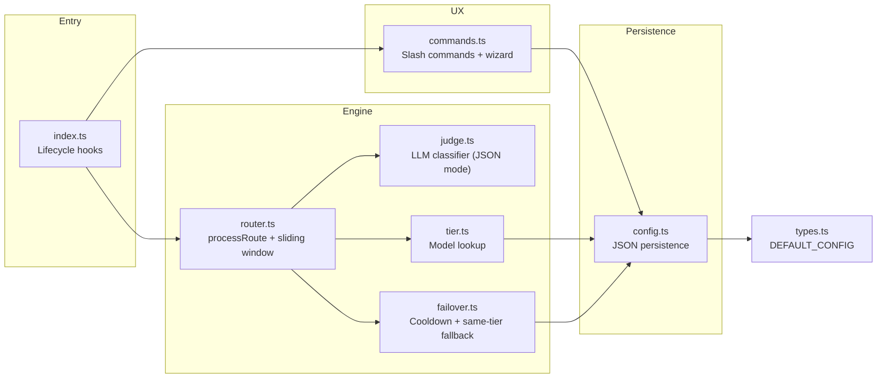

# Contributing to pi-shift-router

Thank you for considering contributing to pi-shift-router! We welcome contributions of all kinds: bug reports, feature requests, documentation improvements, and code changes.

## Code of Conduct

This project is committed to providing a welcoming, inclusive environment for everyone. By participating, you agree to:

- Be respectful and constructive in all communications
- Focus on what is best for the project and its users
- Accept constructive criticism gracefully
- Show empathy towards other community members

## How to Contribute

### Reporting Bugs

1. **Check existing issues** — Search the [issue tracker](https://github.com/green-dalii/pi-shift-router/issues) before filing a duplicate.
2. **Use a clear title** — Summarize the problem concisely.
3. **Provide reproduction steps** — Include the exact command, expected behavior, and actual behavior.
4. **Include environment info** — pi-agent version, OS, Node.js version.

### Feature Requests

1. **Open an issue** first to discuss the feature before implementing.
2. **Describe the problem** you're trying to solve, not just your proposed solution.
3. **Consider scope** — Small, focused changes have a much higher chance of acceptance.

### Pull Requests

1. **Fork the repository** and create a feature branch from `main`.
2. **Follow the code philosophy:**
   - Prefer pure functions over classes and mutable state
   - Keep files small and focused on one responsibility
   - Avoid adding external dependencies
   - Flat code over nested — early return, extract helpers
   - Delete code before adding it — ask "is this truly needed?"
3. **Write clear commit messages** with the module prefix:
   - `feat:` — New feature
   - `fix:` — Bug fix
   - `refactor:` — Code restructuring
   - `docs:` — Documentation changes
   - `test:` — Test additions or changes
   - `chore:` — Build/config changes
4. **Keep PRs focused** — One logical change per PR. Large changes should be broken into smaller PRs.
5. **Update documentation** — README, SPEC, and inline code comments as needed.

### Development Setup

```bash
git clone https://github.com/green-dalii/pi-shift-router.git
cd pi-shift-router
npm install
```

### Type Checking

```bash
npm run typecheck
```

This project is pure TypeScript with strict mode enabled. Ensure your changes pass type checking before submitting.

### Tests

```bash
npm test          # one-shot
npm run test:watch  # watch mode
```

The routing engine has unit tests in `tests/router.test.ts`. Add tests when changing the core algorithm in `src/router.ts`.

## Architecture Notes

```
src/
├── index.ts       # Entry point: pi-agent lifecycle hooks
├── router.ts      # Core routing engine (sliding window + processRoute)
├── judge.ts       # LLM classifier (JSON mode) with "hold position" fallback
├── tier.ts        # Tier validation and model lookup
├── config.ts      # Configuration persistence (user + project layers)
├── commands.ts    # Slash command handlers and the config wizard
├── tui/           # TUI components (model picker)
└── types.ts       # All type definitions and DEFAULT_CONFIG
```

**Dependency rule:** `index → router → judge|tier → config → types`. No circular imports.

## Architecture



### Module Map

| File | Responsibility |
|------|---------------|
| `index.ts` | Lifecycle hooks: `session_start` (read-only), `before_agent_start` (classify + route), `agent_end` (failover), `after_provider_response` (cooldown recovery) |
| `router.ts` | `processRoute()`, `applyModelSwitch()`, sliding window |
| `judge.ts` | LLM Judge with JSON-mode enforcement + 3-layer parse fallback |
| `tier.ts` | Model lookup, `findBestModelForTier()`, display formatting |
| `failover.ts` | Runtime failover: exponential-backoff cooldowns, error signatures, same-tier fallback |
| `config.ts` | JSON persistence, `resolveFastEndpoints()`, validation |
| `commands.ts` | `/router`, `/route-force`, config wizard |
| `tui/model-picker.ts` | TUI picker mirroring pi's native `/model` UX |
| `tui/fallback-chain-editor.ts` | Chain editor: add / remove / reorder tier models with hotkeys |
| `types.ts` | All interfaces + `DEFAULT_CONFIG` |

### Dependency Chain

```
index.ts → router.ts → judge.ts | tier.ts | failover.ts → config.ts → types.ts
commands.ts → config.ts, tier.ts, router.ts, types.ts
```

One-way, no cycles. See [`SPEC.md`](SPEC.md) for the full design.

## Development

### Local install (for testing in pi)

The canonical install is the npm package. For local dev iteration against your checkout, use pi's path install:

```bash
# Remove any globally-installed version first (avoid duplicate plugins)
pi remove pi-shift-router

# Install from local path — pi runs npm install against this folder
pi install /Users/greener/project/slimrouter
```

After changing `src/`, rebuild and restart pi-agent:

```bash
npm run build
# restart pi-agent
```

### Scripts

| Script | What it does |
|--------|--------------|
| `npm run build` | TypeScript compile + copy `prompts/` to `dist/` |
| `npm run typecheck` | `tsc --noEmit` strict mode |
| `npm test` | Run vitest once |
| `npm run test:watch` | vitest watch mode |
| `npm run clean` | Remove `node_modules/` and `dist/` |

## License

By contributing, you agree that your contributions will be licensed under the [MIT](LICENSE) license.

## Releasing a new version

Only maintainers do this. Releases follow a manual checklist because pi's sandbox blocks
`npm run` exit codes and the npm cache is owned by root; the workaround is documented here
so future releases stay reproducible.

```bash
# 1. Bump version (commit message will follow the modules convention)
npm version patch   # or: minor / major

# 2. Validate before publish (test + build + pack:check).
#    If you hit "EPERM" or "Maximum call stack size exceeded" under a sandbox,
#    run the underlying commands directly:
node --experimental-vm-modules node_modules/vitest/vitest.mjs run
node node_modules/typescript/lib/tsc.js
node scripts/copy-assets.mjs
node scripts/pack-check.mjs

# 3. Publish. Use --ignore-scripts when the npm wrapper returns 255
#    even though the underlying commands succeed.
NPM_CONFIG_CACHE=/tmp/npm-cache npm publish --ignore-scripts \
  --registry=https://registry.npmjs.org/

# 4. Push the commit and the tag to GitHub
git push origin main
git push origin v$(node -p "require('./package.json').version")

# 5. Edit the GitHub Release notes for the tag (optional but recommended)
gh release create v$(node -p "require('./package.json').version") --generate-notes
```

After publishing, update your local install:

```bash
pi remove pi-shift-router
pi install npm:pi-shift-router
```
