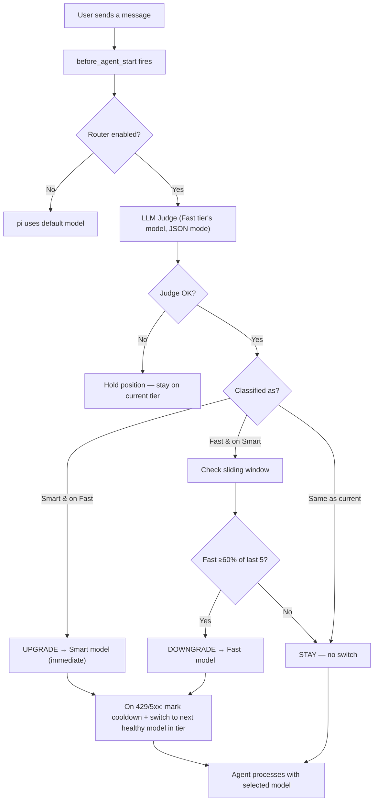

<!--
SEO metadata (not user-visible, parsed by crawlers / LLMs):
- name: pi-shift-router
- type: software / npm package / pi-coding-agent extension / model router / LLM classifier
- license: MIT
- language: TypeScript
- runtime: Node.js >= 24
- dependencies: zero runtime deps
- npm: https://www.npmjs.com/package/pi-shift-router
- repo: https://github.com/green-dalii/pi-shift-router
- docs: README.md / README.zh-CN.md / SPEC.md / CONTRIBUTING.md
- first-published: v0.4.0
- latest: v0.8.2
- alternate-names: shift router, pi extension, model router, two-tier router, auto router, tier model router, model failover router
- search-intents: "auto-route pi agent turns", "LLM as classifier", "two-tier model routing", "model failover on 429", "cost vs quality model selection", "pi-coding-agent extension", "model cooldown exponential backoff", "JSON-mode classifier"
- features: two-tier routing, LLM judge, JSON-mode classifier, sliding-window
  downgrade gate, multi-model fallback chains, TUI chain editor,
  exponential-backoff runtime failover (429/5xx), shared cooldown map
  between routing and Judge, zero-config defaults, cross-provider native,
  token throughput telemetry, /router stats command, recommended model pairings
- direct-competitor: pi-model-router (3-tier + budget + keyword rules; same agent-routing problem)
- author: green-dalii (https://github.com/green-dalii)
- canonical: https://github.com/green-dalii/pi-shift-router/blob/main/README.md
-->

# pi-shift-router

> **pi-shift-router** is a two-tier **auto-routing** model router for the [pi-coding-agent](https://github.com/earendil-works/pi) CLI. It classifies every turn between a **fast Programmer** role and a **smart CTO** role using an LLM-as-classifier (Judge), then routes the run to the right model — with multi-model fallback chains, exponential-backoff runtime failover on 429/5xx, and a shared cooldown map. Pure TypeScript, zero runtime dependencies, one config file.

[](https://www.npmjs.com/package/pi-shift-router)
[](https://www.npmjs.com/package/pi-shift-router)
[](LICENSE)
[](https://www.typescriptlang.org/)
[](https://github.com/earendil-works/pi)
[](https://nodejs.org)
[](https://github.com/green-dalii/pi-shift-router/actions)
[](https://github.com/green-dalii/pi-shift-router)

[English] | [简体中文](README.zh-CN.md)

---

## TL;DR

- **What it is** — A [pi-coding-agent](https://github.com/earendil-works/pi) extension that routes every turn between two **roles**: a fast Programmer (execution-heavy, following known patterns) and a smart CTO (judgment-heavy, complex / high-stakes / irreversible work). The smart role is not a judge — it is the model that actually writes, thinks, and runs tools for the entire turn when the work is complex.
- **How it works** — Before each turn, a small LLM Judge (the fast-tier model itself) classifies the task as `fast` or `smart`. The chosen model then drives the whole turn — all thinking, all tool calls, all message content — at that tier's intelligence level.
- **Reliability** — Multi-model fallback chains per tier + exponential-backoff cooldown on 429/5xx — turns keep flowing when one provider rate-limits.
- **Zero dependencies** — Pure TypeScript. Single `npm install`, two-tier config, done.
- **Stable since** — v0.4.0 (npm, MIT, 204 unit tests, Node 24+).

### In pi, it looks like this

```text
🦾 [deepseek-v4-flash] → fix the failing test
⚖ judging…
🧠 [claude-opus-5]              ← upgraded for the architecture question
⚠️ deepseek-v4-flash 429 → switching to glm-5.2 — retry in 1m
🦾 [glm-5.2]                    ← same-tier failover (v0.6.0)
```

Status bar badge changes tier automatically; toasts explain any switch.

---

## Contents

- [What is pi-shift-router?](#what-is-pi-shift-router)
- [What it does](#what-it-does)
- [Quick Start](#quick-start)
  - [Installation](#installation)
  - [Verify](#verify)
- [How It Works](#how-it-works)
- [Commands](#commands)
- [Configuration Reference](#configuration-reference)
- [Recommended Model Pairings](#recommended-model-pairings)
- [Use Cases](#use-cases)
- [How It Compares](#how-it-compares)
- [FAQ](#faq)
- [Tuning Guide](#tuning-guide)
- [Troubleshooting](#troubleshooting)
- [Roadmap](ROADMAP.md)
- [Contributing](CONTRIBUTING.md)

---

## What is pi-shift-router?

**pi-shift-router** is a **tier model router** (also called a **shift router** or **two-tier auto router**) for the [pi-coding-agent](https://github.com/earendil-works/pi) CLI. It is a small npm extension that sits between you and the LLM provider: each time you send a message to pi, it classifies the turn with an **LLM-as-classifier** (the Judge), then routes the entire agent run to the right model.

Two tiers, by mental mode:

- 🦾 **Fast** — execution-heavy model that drives the whole turn for routine / well-defined work (writing code, running tests, fixing bugs, applying known patterns).
- 🧠 **Smart** — high-intelligence model that drives the whole turn for complex / high-stakes / irreversible work (architecture, design review, security audit, multi-step planning).

It is **not** a third-party router that you need to learn a new CLI for; it is an in-process pi extension that adds a status bar badge, a config command, and a Judge hook. It is **not** a budget tracker, an ML classifier, or a remote proxy: it is a local TypeScript router with zero runtime dependencies.

If you've ever wished pi could automatically pick a cheaper model for the boring turns and a stronger model for the critical turns — that's what this does.

## What it does

**pi-shift-router** classifies every turn by **mental mode** and routes between two roles:

| Role | Tier | Emoji | What it does for the whole turn | When |
|------|------|-------|----------------------------------|------|
| **Programmer** | Fast | 🦾 | Executes: writes code, runs tests, fixes the bug, follows the established pattern | Routine, well-defined, low stakes |
| **CTO** | Smart | 🧠 | Drives the entire turn when the work is complex: architecture, design review, security audit, multi-step planning, irrecoverable actions, "very deep" reasoning | High stakes, irreversible, ambiguous, or user asks for depth |

The fast tier is **not** a real Programmer — it's a model that handles execution; the smart tier is **not** a real CTO — it's the model that handles complex judgment, but it also **does all the work itself** (writes the code, calls the tools, runs the loop). The LLM Judge is a small one-shot classification call; the chosen tier then drives the entire agent run.

**Zero behavior change by default** — both tiers start empty. The router does nothing until you assign models via `/router config`.

> **Smart = CTO** (few turns, but each one critical — sets direction, signs off on architecture, reviews complex work, drives the whole turn when stakes are high)
> **Fast = Programmer** (large workload, well-defined patterns — writes code, runs tests, fixes the bug, drives the whole turn when the path is clear)

Not every task needs a CTO. But projects without CTO oversight don't sustain quality.

---

## Quick Start

**Prerequisites** — Node.js ≥ 24, [pi-coding-agent](https://github.com/earendil-works/pi) ≥ 0.80, one provider account with API key in pi-agent's `auth.json`, one model for each tier.

### Installation

Install from npm:

```bash
pi install npm:pi-shift-router
```

Install from a local checkout (development):

```bash
pi install <path-to-this-repo>
```

Install from a git URL:

```bash
pi install git:github.com/green-dalii/pi-shift-router
```

All three forms register the extension in `~/.pi/agent/settings.json` and auto-load on the next pi launch. See [pi's packages docs](https://github.com/earendil-works/pi/blob/main/packages/coding-agent/docs/packages.md) for the full install grammar.

### Verify

Open the TUI wizard and pick a Fast model and a Smart model — or several per tier to form a fallback chain:

```text
/router config
```

Save to user or project scope; project wins on conflict. See [Configuration Reference](#configuration-reference) for the full JSON schema.

Then run:

```text
/router status
```

…to see your tiers, current scope, the configured Judge threshold, and the streaming telemetry. The next turn triggers the first Judge call.

---

## How It Works



Three properties that matter:

- **Upgrades are immediate** (Fast → Smart). Quality first.
- **Downgrades need a sustained trend** (weighted fast share ≥ `threshold`, default 0.6, over the last 5 turns; votes below `minConfidence` are ignored). This protects the smart tier's context cache from premature downgrades.
- **One classification per turn.** No thrashing during tool calls.

**JSON-mode enforcement** (not just prompt instructions): OpenAI-compatible APIs use `response_format: { type: "json_object" }` (the API rejects non-JSON completions); Anthropic uses assistant prefill `{` to force JSON-start output. While the Judge is in flight, the status bar shows `⚖ judging…`.

### Runtime failover (v0.6.0)

When the primary model hits 429 / 5xx / quota / Token-Plan exhaustion, pi retries first (provider ×3, agent ×3), then the router takes over:

1. Mark the failing model into **exponential-backoff cooldown** (1m, 2m, 4m, … capped at 30m).
2. Immediately `setModel` to the next healthy model **in the same tier** (no cross-tier).
3. pi's pending retry continues with the fallback — same-turn failover.
4. Subsequent turns skip cooled models in `before_agent_start`.
5. A 2xx response clears the cooldown; session restart resets everything.

The Judge also walks the full fast-tier chain before giving up, sharing the same cooldown map as routing. Manual override (`/route-force`) always bypasses cooldowns. Auth/config errors (400/401) never trigger failover.

---

## Commands

| Command | What it does |
|---------|--------------|
| `/router status` | Show tier, model, window, config summary |
| `/router on` / `/router off` | Enable / disable routing |
| `/router config` | Launch the TUI configuration wizard |
| `/router quiet` | Toggle inline toast notifications |
| `/router verbose` | Toggle verbose console logging |
| `/route-force <tier>` | Pin Smart or Fast for the next turn |
| `/route-force <provider>/<model>` | Pin a specific model for the next turn |
| `/route-force auto` | Clear manual override |

---

## Configuration Reference

> **The recommended way to configure is `/router config` — a TUI wizard.** You won't normally need to touch JSON. Use the JSON reference below when scripting, sharing config across machines, or pinning to a project repo.

**Configurable from the TUI (`/router config`):**

- Master on/off (`/router on` / `/router off`)
- Per-tier model chain — add / remove / reorder (`a`, `x`, `J` / `K`, `d` save, `Esc` cancel)
- Save scope: user (`~/.pi/agent/pi-shift-router.json`) or project (`<cwd>/.pi/pi-shift-router.json`); project wins on conflict.

**Configurable only via JSON** (advanced — these are not in the TUI):

- `routing.judgeTimeout`, `routing.window.minConfidence`, `routing.window.threshold`
- `ux.quietMode`, `ux.routerLogVerbose`

For these, edit the JSON file directly — the schema is below. After saving, run `/router config` once to re-load, or restart pi.

### JSON Schema (reference)

Two layers, with the **configurable from TUI** block written automatically by the wizard and the **advanced block** for hand-editing:

```text
~/.pi/agent/pi-shift-router.json         (user scope — wins by default)
<cwd>/.pi/pi-shift-router.json           (project scope — wins on conflict)
```

```text
pi-shift-router.json
├── enabled                    boolean  master switch; default true
├── tiers
│   ├── fast
│   │   └── models[]           ordered list; first is primary, rest are fallbacks
│   │       ├── provider       string   must match a provider in pi-agent's auth.json
│   │       ├── model          string   model ID within that provider
│   │       └── priority       integer  1 = primary, 2 = first fallback, …
│   └── smart                  same shape as fast
├── routing
│   ├── mode                   "auto" | "manual"; default "auto"
│   ├── judgeTimeout           ms; default 5000
│   └── window
│       ├── size               sliding-window length; default 5
│       ├── threshold          weighted fast-share to trigger downgrade; default 0.6
│       └── minConfidence      votes below this are ignored; default 0.5
└── ux
    ├── quietMode              suppress inline toasts; default false
    ├── statusBar              show the 🦾 / 🧠 badge; default true
    ├── inlineToast            show model-switch toasts; default true
    └── routerLogVerbose       log to console; default false
```

**Minimal working config** (one model per tier, all defaults elsewhere):

```text
enabled:  true
tiers:
  fast:   [{ provider: openai, model: gpt-5.6-luna }]
  smart:  [{ provider: openai, model: gpt-5.6-sol }]
```

**Multi-provider with per-tier fallback chains** (the typical production setup):

```text
enabled:  true
tiers:
  fast:
    - { provider: deepseek,   model: deepseek-v4-flash, priority: 1 }
    - { provider: z.ai,       model: glm-5.2,           priority: 2 }
    - { provider: xai,        model: grok-4.5-fast,     priority: 3 }
  smart:
    - { provider: anthropic,  model: claude-opus-5,     priority: 1 }
    - { provider: openai,     model: gpt-5.6-sol,       priority: 2 }
    - { provider: moonshotai, model: kimi-k3,           priority: 3 }
```

Field-by-field defaults:

| Field | Default | Meaning |
|-------|---------|---------|
| `enabled` | `true` | Master switch. Use `/router off` to disable. |
| `tiers.<tier>.models[]` | `[]` | Ordered by `priority`. First hit wins; rest are run-time fallbacks. |
| `routing.judgeTimeout` | `5000` | ms. Judge API call timeout. |
| `routing.window.size` / `threshold` | `5` / `0.6` | Sliding-window downgrade gate. |
| `routing.window.minConfidence` | `0.5` | Votes below this confidence are ignored. |
| `ux.quietMode` / `statusBar` / `inlineToast` / `routerLogVerbose` | various | Display / logging controls. |

---

## Recommended Model Pairings

No JSON snippets here — your provider setup is yours. This section teaches **how to choose**, not **how to fill**. Data is snapshotted from [models.dev](https://models.dev/) on 2026-08-05; refresh with `curl -s https://models.dev/api.json | jq` to see the latest.

> **Fast tier rule of thumb**: if your provider exposes `deepseek-v4-flash` (2026-07), prefer it for `fast` — the 0731 refresh pushed quality close to Opus 5 / GLM-5.2 territory while keeping prices at the low end of the table.
>
> **Smart tier rule of thumb**: keep `smart` on a frontier cloud model. Local smart is impractical on hardware under ~80 GB of VRAM/unified memory, and even at 96 GB the cost/quality tradeoff almost never beats a flat-fee token plan.

### Pattern 1 — Token-plan bundles (one key, many models)

Lists candidate model IDs you can mix across the chain — not a single canonical pairing. Provider names below are well-known aggregate / token-bundle gateways that proxy Anthropic, OpenAI, Google, DeepSeek, xAI, Z.AI, Qwen, Moonshot, and others under one billing account.

| Plan | `fast` candidates 🦾 | `smart` candidates 🧠 |
|---|---|---|
| **Alibaba Token Plan** (intl + CN) | `qwen3.7-plus`, `qwen3.6-flash`, `deepseek-v4-flash` | `qwen3.8-max`, `qwen3.7-max`, `kimi-k3` |
| **Vercel AI Gateway** | any of the providers below through one gateway | any of the providers below |
| **OpenRouter** | 200+ models; `auto` is **not** a valid Judge target (opaque) | 200+ models |
| **Hugging Face Inference** | `Qwen/Qwen3.5-9B`, `Qwen/Qwen3.6-35B-A3B` | `Qwen/Qwen3.6-27B`, `google/gemma-4-31B-it` |
| **Nebius Token Factory** | `deepseek-ai/DeepSeek-V4-Flash`, `moonshotai/Kimi-K2.7-Code` | `Kimi-K3`, `zai-org/GLM-5.2`, `Qwen/Qwen3.7-Max` |
| **NovitaAI** | `deepseek-ai/DeepSeek-V4-Flash`, `Qwen/Qwen3.6-27B` | `moonshotai/Kimi-K3`, `Qwen/Qwen3.7-Max` |

### Pattern 2 — Local models by VRAM / unified memory

All picks below were verified against HuggingFace's `safetensors` total weight size on 2026-08. Older generations (2025 and earlier), end-device outputs (<7 B), and pre-Qwen3.5 / pre-DeepSeek-V3 models were excluded as too dated. 

> fp16 is a benchmark artifact, not a runtime format. Production local deployments use **q4-k-m / NVFP4 / MXFP4 / AWQ-int4 / 1–2 bit ternary**. The table below reflects that — nothing in `fast` runs at fp16.
>
> The `AxxB` suffix on a MoE model name means **active parameters per token**. `DeepSeek-V4-Flash-0731` is 83.4 B total / ~13 B active; int4 disk = 41.7 GB. Quant size scales with **active parameters**, not total.

| VRAM / unified memory | Local `fast` candidates | Quant | Local `smart` candidates (64 GB+) |
|---|---|---|---|
| **≤ 16 GB** (RTX 4070 12 GB, M-series 16 GB entry tiers) | `LiquidAI/LFM2.5-8B-A1B` (8.5 B total, 2026-05), `ibm-granite/granite-4.1-8b` (8.8 B, 2026-04), `ornith-ai/Ornith-1.0-9B-GGUF` (~9 B Q4_K_M ≈ 5.6 GB) | q4-k-m | — |
| **16–32 GB** (RTX 4090 24 GB, M3 Pro 18 GB, M4 Pro 24 GB) | `Qwen/Qwen3.6-27B` (27.8 B, q4 ≈ 14 GB, current HF top), `Qwen/Qwen3.8-27B` (27 B-class, when released — watch the Qwen org page), `nvidia/Qwen3.6-27B-NVFP4` (NVFP4 ≈ 14 GB), `google/gemma-4-26b-a4b-it` (26.5 B, q4 ≈ 13 GB), `Qwen/Qwen3.6-35B-A3B` (36 B, q4 ≈ 18 GB) | q4-k-m / NVFP4 | — |
| **32–64 GB** (M2 Ultra 64 GB, RTX 4090 48 GB) | `nvidia/NVIDIA-Nemotron-3-Nano-Omni-30B-A3B-Reasoning` (30 B q4 ≈ 15 GB), `google/gemma-4-31B-it` (31.3 B q4 ≈ 16 GB) | NVFP4 / q4-k-m | — |
| **64–128 GB** (A100 80 GB, RTX 6000 Ada 48 GB ×2) | `poolside/Laguna-XS-2.1` (33.4 B q4 ≈ 17 GB, 2026-06), `farbodtavakkoli/OTel-2.0-LLM-31B-IT` (32.1 B q4 ≈ 16 GB, Gemma4 base, 2026-07) | q4-k-m / NVFP4 | `prism-ml/Bonsai-27B-gguf` (27 B, 1.71-bit ternary ≈ 6 GB on disk, runs on phone; on 64 GB use the 2-bit MLX/GGUF for quality, 2026-07), `ornith-ai/Ornith-1.0-35B-GGUF` (35 B MoE multimodal, 2026-06), `InternScience/Agents-A1` (35.1 B MoE agentic, q4-k-m ≈ 18 GB, 2026-06) |
| **≥ 128 GB** (M3 Ultra 192 GB, M2 Ultra 192 GB, **NVIDIA DGX Spark 128 GB GB10 unified**, RTX 4090 ×4) | `poolside/Laguna-S-2.1` (117.6 B q4 ≈ 59 GB, 2026-07), `mistralai/Mistral-Medium-3.5-128B` (127.7 B q4 ≈ 64 GB, 2026-03) | q4 / NVFP4 | `nvidia/NVIDIA-Nemotron-3-Super-120B-A12B` (120 B, NVFP4 ≈ 60 GB), `nvidia/DeepSeek-V4-Flash-NVFP4` (83.4 B / ~13 B active, NVFP4, 2026-05-18, NVIDIA-published), `unsloth/DeepSeek-V4-Flash-GGUF` (83.4 B / ~13 B active, q4 ≈ 42 GB, 2026-07), `bartowski/DeepSeek-V4-Flash-0731-GGUF` (83.4 B / ~13 B active, q4 0731 refresh, 2026-07-31), `Qwen/Qwen3.6-27B-FP8` (NVFP4-equivalent ~14 GB) |

Notes:

- **Quantized variants ship as separate HF repos**. `nvidia/Qwen3.6-35B-A3B-NVFP4`, `cyankiwi/Qwen3.6-27B-AWQ-INT4`, `OsaurusAI/Ornith-1.0-35B-MXFP4`, `prism-ml/Bonsai-27B-gguf`, `poolside/Laguna-S-2.1-NVFP4` — ollama / vLLM / MLX pick them up automatically.
- **Pick a runtime that exposes an OpenAI-compatible API** — the plugin does not bind to any specific one. Common choices: **ollama** (`ollama run qwen3.6:27b` → server on `:11434`), **LM Studio** (MLX + GGUF), **vLLM**, **llama.cpp** / **llama-server**, **exo**, **llamafile**.
- **Judge also needs a JSON-mode endpoint**. Qwen 3.5+ and Gemma 4 expose `tool_call=true`, so they satisfy the Judge's JSON-mode constraint — but local Judge adds ~0.5–2 s per turn. Recommended: `fast` local + `smart` local-or-cloud + Judge on whichever `smart` you trust most.

### Pattern 3 — Same-provider tier ladder (simplest)

One provider, one bill, one rate-limit pool. Use this if you already have a paid account with the provider and don't want to juggle keys.

| Provider | `fast` 🦾 | `smart` 🧠 | Note |
|---|---|---|---|
| **Anthropic** | `claude-sonnet-5` | `claude-opus-5` or `claude-fable-5` | Sonnet 5 is the current `fast` tier. |
| **OpenAI** | `gpt-5.6-luna` | `gpt-5.6-sol` | GPT-5.6 has `luna` < `terra` < `sol` internal tiering. |
| **Google** | `gemini-3.5-flash-lite` | `gemini-3.6-flash` | Gemini 3.x, 1 M context on both tiers. |
| **Qwen (Alibaba)** | `qwen3.7-plus` | `qwen3.8-max` | Native `plus` / `max` split. |
| **DeepSeek** | `deepseek-v4-flash` | `deepseek-v4-pro` | `flash` ≈ mini pricing tier, `pro` ≈ flagship. |
| **Z.AI (GLM)** | `glm-5` or `glm-5-turbo` | `glm-5.2` | GLM-5 series. |
| **xAI (Grok)** | `grok-4.5-fast` | `grok-4.5` | Grok 4.5 generation. |

### Pattern 4 — Cross-provider pairing (best-of-breed)

When you want the strongest model in each tier, regardless of who sells it. The default `fast` pick below is `deepseek-v4-flash` wherever available; the default `smart` pick is `claude-opus-5`, with `gpt-5.6-sol` and `kimi-k3` as cross-provider fallback.

| Scenario | `fast` 🦾 | `smart` 🧠 |
|---|---|---|
| Coding + lowest cost | `deepseek/deepseek-v4-flash` | `anthropic/claude-opus-5` |
| Coding + multi-provider fallback | `deepseek-v4-flash` + `glm-5.2` (fallback) | `claude-opus-5` + `gpt-5.6-sol` + `kimi-k3` (fallback chain) |
| Coding + flat-fee (best $/quality) | `alibaba-token-plan/deepseek-v4-flash` | `alibaba-token-plan/qwen3.8-max` |
| 1 M context, long repo / PDF research | `deepseek-v4-flash` | `google/gemini-3.6-pro` or `kimi-k3` |
| Multimodal (image / video) | `deepseek-v4-flash` | `anthropic/claude-opus-5` (vision) or `google/gemini-3.6-pro` |
| Multilingual, Chinese-first | `deepseek-v4-flash` | `alibaba/qwen3.8-max` |
| Europe / GDPR preference | `deepseek-v4-flash` (via OpenRouter) | `mistral/mistral-medium-2604` |

---

For live pricing and the full model catalog per provider, see [models.dev](https://models.dev/). Model IDs above are real as of the snapshot date; if a provider returns `model_not_found`, run `curl -s https://models.dev/api.json | jq '.<provider>.models | keys'` and update.

---

## Use Cases

Five patterns where the auto-routing tier model router pays for itself immediately.

**1. Cost-quality split for a long coding session.** Configure `fast = deepseek-v4-flash` and `smart = claude-opus-5`. Routine turns (file edits, test runs, doc fixes) stay on the cheap model; the strong model only fires when the Judge sees architecture / review / planning signals.

**2. One provider, two tiers — zero ops.** Configure `fast = gpt-5.6-luna` and `smart = gpt-5.6-sol` on the same OpenAI account. No multi-provider juggling, one bill, one rate-limit pool. The router never bridges providers; it just switches models within your existing setup.

**3. Resilience when a provider rate-limits mid-session.** Configure each tier as a chain of 2–3 models (e.g. `fast = [deepseek-v4-flash, glm-5.2, grok-4.5-fast]`). When the primary returns 429 / 5xx, the router marks it cooldown (exponential backoff 1m→2m→4m…30m), immediately calls `setModel` to the next healthy entry in the same tier, and pi's pending retry continues against the fallback. Subsequent turns skip cooled models without retrying. Manual `/route-force` always bypasses cooldown.

**4. Multi-provider best-of-breed (recommended for serious work).** Configure `fast = [deepseek-v4-flash, glm-5.2]` and `smart = [claude-opus-5, gpt-5.6-sol, kimi-k3]`. Each tier draws from different providers — if Anthropic rate-limits, smart falls back to OpenAI then Moonshot; if DeepSeek rate-limits, fast falls back to GLM. The Judge also walks the fast-tier chain on failure. One JSON file, three providers, full resilience.

**5. Sticky deep mode without per-prompt hand-tuning.** Most users want pi to stay on the strong model during a planning session, then come back down once they're editing files. The [sliding-window weighted downgrade gate](#how-it-works) (default `size: 5`, `threshold: 0.6`, `minConfidence: 0.5`) does this without you having to think about it: upgrades are always immediate, downgrades only happen after a sustained fast trend. Bump `threshold` to `0.8` if you want smart stickier.

---

## How It Compares

Both solve the same problem — per-turn agent-routing to a different model tier — but bet differently on what "good classification" looks like.

| | 🦾 **pi-shift-router** (this plugin) | pi-model-router |
|---|---|---|
| **🧠 Classifier** | ✅ LLM Judge (JSON mode) — always LLM, natural-language reasoning | ⚠️ Optional LLM classifier → heuristic / keyword fallback |
| **🪜 Tier count** | ✅ 2 (fast / smart) — small surface, easy to reason about | 3 (high / medium / low) — more knobs |
| **📝 Custom rules** | ✅ None — Judge reads natural-language signals | ⚠️ Keyword-based overrides (manual / regex / etc.) — maintenance burden |
| **💰 Budget cap** | — | USD session budget, auto-downgrades high → medium |
| **🗂️ Persistence** | Session-scoped | Cross-session, cross-branch (`router-state`) |
| **🛡️ Runtime failover** | ✅ 429/5xx + exponential-backoff cooldown, shared with Judge | Profile-level fallback chain |
| **📦 Deps** | ✅ Zero runtime | npm package on pi SDK |

**The two philosophies:**

- **🦾 pi-shift-router bets on "less is more"** — 2 tiers is small enough to reason about, the Judge is a single LLM call you can read and re-prompt, and there are no keyword lists to maintain. Less surface area → fewer surprises. The Judge's reasoning is LLM-based, so it generalizes to prompts you didn't anticipate (no rule to add when a new task style appears).
- **pi-model-router bets on "more control"** — 3 tiers + explicit budget caps + rule overrides is more expressive when you want to enforce a hard USD ceiling or pin specific phrases to specific tiers, but the rule list becomes a maintenance artifact: every new provider or new prompt style is potentially a new rule. The heuristic fallback is opaque — when the LLM classifier is unavailable, the keyword layer silently makes different choices.

**Pick by need:**

- **🦾 pi-shift-router** — if you want zero deps, JSON-mode LLM Judge, runtime failover (429/5xx cooldown), and a small surface you can read end-to-end.
- **pi-model-router** — if you want a hard USD session budget cap, cross-session state, or keyword pinning.

---

## FAQ

### What if I don't configure any models?

Both tiers start empty. The router is a no-op; pi uses its default model. Run `/router config`.

### Does the Judge add noticeable latency?

A Judge call costs a few thousand tokens at your Fast-tier pricing. End-to-end classification round-trip is typically 200ms–2s. The status bar shows `⚖ judging…` during the call.

### What if my primary model 429s or times out?

Exponential-backoff cooldown (v0.6.0): primary goes into cooldown (1m → 2m → 4m … capped 30m) and the next healthy model in the same tier takes over. A 2xx response clears the cooldown immediately.

### Does this work across different providers?

Yes. Each tier stores an ordered list of `{provider, model, priority}` pairs. Mix freely.

### Will it downgrade Smart prematurely?

Only when the **weighted** ratio of fast votes in the last 5 classified turns is ≥ `window.threshold` (default `0.6`). Low-confidence votes below `window.minConfidence` (default `0.5`) are ignored. Raise `threshold` to `0.8` to stay on Smart longer. Upgrades (Fast → Smart) are always immediate.

### What's the difference from `pi-model-router`?

Direct competitor — same problem (per-turn routing to a different model tier), different implementation choices. See [How It Compares](#how-it-compares). Pick based on which tradeoffs fit your workflow: zero deps + JSON Judge + runtime failover + small surface, vs 3-tier + budget cap + keyword rules + cross-session state.

### Can I disable the router temporarily without uninstalling?

`/router off` disables for the current session; `/router on` re-enables. Toggle persists in the config file.

### Is there cost overhead from the Judge?

The Judge uses the Fast-tier model (typically your cheapest). Savings from avoiding unnecessary Smart-tier turns dwarf this cost.

---

## Tuning Guide

Each knob has tradeoffs. Pick by workload:

| Your session looks like… | Try… | Why |
|---|---|---|
| Lots of routine work (CRUD, tests, docs); little architecture | `threshold: 0.5`, `minConfidence: 0.7` | Aggressive downgrade — fewer spurious Smart hits |
| Heavy architecture / planning / code review | `threshold: 0.8`, `minConfidence: 0.4` | Conservative downgrade — stay on Smart longer |
| Mixed — 20 fast turns then a planning burst | Defaults (`threshold: 0.6`, `minConfidence: 0.5`) | Balanced |
| Judge tends to over-confident (most votes ≥0.9) | `minConfidence: 0.7` | Strip the over-confident votes |
| Judge tends to uncertain (many 0.3–0.6 votes) | `minConfidence: 0.3` | Don't drop uncertain votes |
| Primary fast model keeps 429'ing | Add a second provider as `tiers.fast.models[1]` | v0.6.0 runtime failover picks it up |
| Heavy streaming / long agent runs | Watch `/router stats` tokens/sec | See per-turn throughput |

### Knob reference

**`routing.judgeTimeout`** (ms) — Judge API call timeout. Default `5000`. Raise on slow providers, lower on flaky networks.

**`routing.window.size`** — Sliding-window length. Default `5`. Larger is more stable (less reactive); smaller is more agile (more jittery).

**`routing.window.threshold`** (0–1) — weighted fast-share threshold for downgrade. Default `0.6`.
- `0.5`: a slight fast majority downgrades.
- `0.6`: balanced (default).
- `0.8`: a strong fast majority required to downgrade.
- `1.0`: never downgrade (sliding window disabled).

**`routing.window.minConfidence`** (0–1) — votes below this confidence are discarded. Default `0.5`. Set to `0` to restore v0.6.0's equal-weight counting; set to `0.7+` to count only confident votes.

**`tiers.<tier>.models[]`** — ordered by priority. First is primary; rest are runtime fallback (v0.6.0). Put the cheapest healthy model first.

**`ux.routerLogVerbose`** — set `true` (or `/router verbose`) to log every decision to the console. Useful while calibrating `threshold`.

### Reading `/router stats`

```text
Tier: smart / p/claude-opus-5
Window: 3 entries (confidence: high=2 mid=1 low=0 none=0)
Transitions: ↑upgrade=1 ↓downgrade=0
Tokens: total 12,345 | speed current=23 avg=25 tok/s
Cooldowns: none
```

- **`high` / `mid` / `low` / `none`** — confidence distribution of the sliding-window entries. If `none` is high, your Judge isn't returning a confidence field (older prompt or old binary). Re-run `/router config` to refresh.
- **`avg tok/s`** — recent per-turn throughput. Use it to spot provider slowdowns.
- **`upgrade` / `downgrade`** — tier-switch counts. Too many downgrades → raise `threshold`; too few → lower it.

---

## Troubleshooting

### Judge unparseable warning

- **Reasoning model ran out of tokens** — DeepSeek Reasoner emits `reasoning_content` then JSON in `content`. Router sets `max_tokens: 4000`; very long prompts may overflow. Run `/router verbose` to inspect.
- **Provider doesn't support JSON mode** — some custom OpenAI-compatible endpoints ignore `response_format`.
- **API key invalid** — check pi-agent's `auth.json`.

### "Judge fetch failed for … : TypeError: Cannot read 'slice' of undefined"

This was fixed in v0.8.0 (commit `de6073a`+). Root cause: `JSON.stringify(undefined)` returns `undefined`, not the string `"undefined"`. When the Judge endpoint returned 200 but with an error-shaped body (no `choices[]`), the verbose log crashed on `content.slice(...)`. Now wrapped in a `jsonStr()` helper that returns `"undefined"` for undefined input. If you still see this on older installed versions, reinstall with `pi remove pi-shift-router && pi install <path-to-this-repo>` (e.g. `pi install .` from the repo root).

### "No models match" in wizard

Models come from pi-agent's `models-store.json`. Restart pi-agent after adding a new provider.

### Status bar shows `⛔`

Router disabled — run `/router on`. If `enabled: true` in config but still shows `⛔`, check the `Config:` line in `/router status`.

### "Model not found" warning

Model ID doesn't exist in the provider. Update the ID or re-pick via `/router config` (only shows real models).

### Router keeps downgrading to Fast

See the [Tuning Guide](#tuning-guide). Most often: raise `routing.window.threshold` to `0.8`, or enable `ux.routerLogVerbose` to see why the Judge is voting the way it is.

---

## Acknowledgements

- **[pi-coding-agent](https://github.com/earendil-works/pi)** by earendil-works — the host agent.
- **[pi-tui](https://www.npmjs.com/package/@earendil-works/pi-tui)** — TUI primitives used by the model picker.
- **[pi-model-router](https://github.com/yeliu84/pi-model-router)** — direct routing competitor: 3-tier, USD budget cap, keyword overrides, cross-session persistence. See [How It Compares](#how-it-compares) for the full diff.

---

**Author & License** — pi-shift-router by [green-dalii](https://github.com/green-dalii), licensed under [MIT](LICENSE) © 2026.