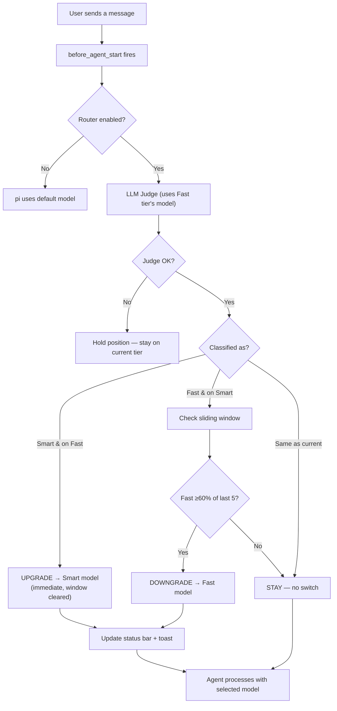
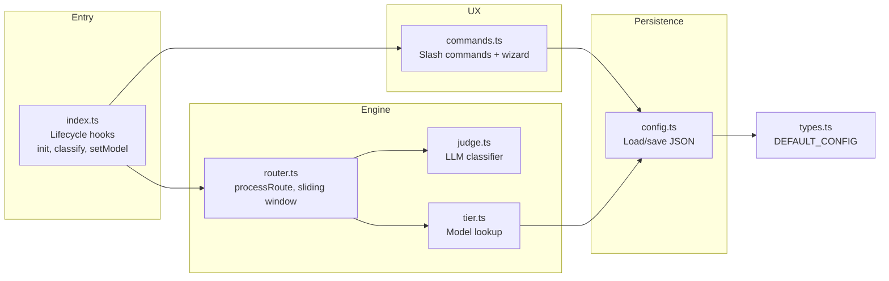

# Slim Router

> Routes every task to the right model — no more manual `/model` switching.

[](LICENSE)
[](https://www.typescriptlang.org/)
[](https://github.com/earendil-works/pi-coding-agent)

---

## The Problem

Pi-agent supports multiple providers, but every conversation is locked to a single model.

If you're using a cheap model for daily work, complex architecture tasks suffer.
If you're using a top-tier model for everything, you're burning money on trivial turns.
And manually switching `/model` every few minutes is not a workflow — it's a tax.

## The Solution

**Slim Router** hooks into pi-agent's turn cycle, classifies each task by **mental mode** (execution vs judgment), and seamlessly switches the active model.

- **Two tiers** — Smart (🧠 CTO) and Fast (🦾 Programmer). One model per tier.
- **LLM Judge** — Uses the Fast model (`~$0.00007/call`) to classify tasks as "execution" or "judgment".
- **Sliding window** — Prevents model thrashing: only downgrades when ≥60% of last 5 turns agree.
- **Zero-config until you want it** — Both tiers start empty. The router does nothing until configured.
- **Interactive setup** — `/router config` launches a TUI picker matching pi's native `/model`: real-time fuzzy search, 10-item sliding viewport, arrow keys, Enter to select, Esc to cancel.
- **Cross-provider native** — Fast can be DeepSeek Flash, Smart can be Kimi K3. Mix and match.

### The Analogy

> **Smart = CTO** (judgment, architecture, review, planning)
> **Fast = Programmer** (execution, coding, debugging, testing)

Not every task needs a CTO. But projects without CTO oversight don't sustain quality.

---

## Quick Start

```bash
# Install the package
pi install npm:pi-slim-router

# Launch the configuration wizard
/router config

# Pick a model for Smart (🧠) and Fast (🦾)
# Save & exit — you're done
```

The router activates on the next turn. Run `/router status` to see it in action.

---

## How It Works



### Key properties

- **Upgrades** (fast → smart) are **immediate**. Quality first.
- **Downgrades** (smart → fast) require **sustained trend** (≥60% of last 5). Cache protection.
- **Manual override** (`/route-force smart`) pins a model for one turn, auto-clears.
- **Each turn is one classification** — no tool-call granularity.

---

## How It Compares

| | Slim Router | pi-router | pi-smart-router |
|---|---|---|---|
| **What it does** | Routes by task complexity — execution vs judgment | Fails over between providers | ML-optimized inference pipeline |
| **Judge** | LLM-as-judge (uses Fast tier's model, ~$0.00007/call) | Manual strategy config | ONNX + Aho-Corasick classifier |
| **Dimension** | Mental mode (execute vs decide) | Provider reliability | Execution engine |
| **Config** | 2 models (Smart + Fast) | Channel strategies | 12-stage pipeline |
| **Deps** | Zero runtime (TS only) | Zero runtime | ONNX, SQLite, HF |
| **Learning curve** | Low — pick 2 models, done | Low-Medium | High |

**In short:** These are complementary. Slim Router picks the right model **when both are working**.
pi-router handles **provider failover**. They solve different problems.

---

## Commands

| Command | What it does |
|---------|--------------|
| `/router status` | Show tier, model, window, and config summary |
| `/router on` | Enable routing |
| `/router off` | Disable routing — pi falls back to its default model |
| `/router config` | Launch the TUI configuration wizard |
| `/router quiet` | Toggle inline toast notifications |
| `/route-force <tier>` | Pin Smart or Fast for the next turn |
| `/route-force auto` | Clear manual override |

---

## Configuration

Two-layer config: user (`~/.pi/agent/`) + project (`.pi/`). Project wins.

```json
{
  "enabled": true,
  "tiers": {
    "fast":  { "models": [{ "provider": "deepseek", "model": "deepseek-v4-flash" }] },
    "smart": { "models": [{ "provider": "kimi", "model": "kimi-k3" }] }
  },
  "routing": {
    "mode": "auto",
    "judgeTimeout": 5000,
    "window": { "size": 5, "threshold": 0.6 }
  },
  "ux": {
    "quietMode": false,
    "statusBar": true,
    "inlineToast": true
  }
}
```

---

## Architecture



### Dependency Chain

```
src/
├── index.ts        → router.ts, judge.ts, tier.ts, commands.ts
├── router.ts       → tier.ts, types.ts
├── judge.ts        → types.ts (+ prompts/judge.md)
├── tier.ts         → types.ts
├── commands.ts     → config.ts, tier.ts, router.ts, types.ts
├── config.ts       → types.ts
├── tui/
│   └── model-picker.ts  (TUI component, active only in interactive mode)
└── types.ts        (zero deps — project root)
```

### File Map

| File | Responsibility |
|------|---------------|
| `index.ts` | Lifecycle hooks: `session_start`, `before_agent_start` |
| `router.ts` | `processRoute()`, `applyModelSwitch()`, sliding window |
| `judge.ts` | LLM Judge + fallback "hold" |
| `tier.ts` | Model lookup, `findBestModelForTier()`, display |
| `config.ts` | JSON persistence, `resolveFastEndpoint()` |
| `commands.ts` | `/router`, `/route-force`, config wizard |
| `types.ts` | All interfaces, `DEFAULT_CONFIG` |

---

## Development

```bash
git clone https://github.com/green-dalii/pi-slim-router.git
cd pi-slim-router
npm install
npm run build
npm test
```

### Principles

- **Simplicity over complexity.** Prefer expressions, delete before adding.
- **Two-tier > three-tier.** Execution vs judgment is the only axis that matters.
- **LLM judge, not regex.** No keyword lists. The LLM is the sole classifier.
- **Zero external runtime deps.** Only pi-agent SDK.
- **Tests cover the algorithm.** 12 tests on the routing engine.

[Full design rationale →](SPEC.md)

---

## License

[Apache 2.0](LICENSE) © 2026 Slim Router Contributors
