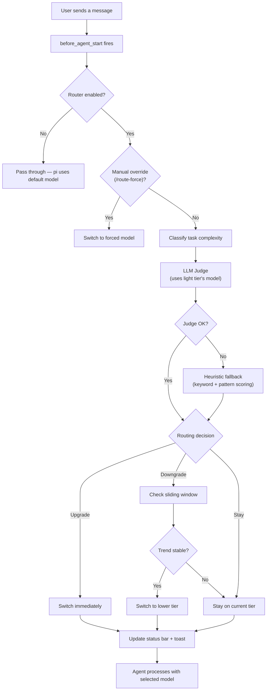
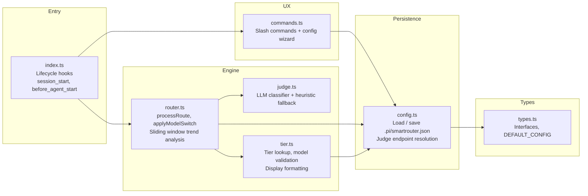

# Smart Router

> Automatically routes every task to the optimal model — no more manual `/model` switching.

[](LICENSE)
[](https://www.typescriptlang.org/)
[](https://github.com/earendil-works/pi-coding-agent)

---

## The Problem

Pi-agent supports multiple providers, but every conversation is locked to a single model.
You either waste flagship tokens on trivial questions, or get stuck with a lightweight model for complex work.
There's no in-between.

## The Solution

**Smart Router** hooks into pi-agent's turn cycle, classifies each task in real time, and seamlessly switches the active model — without interrupting your workflow.

- **Three tiers** — Flagship (🧠), Medium (🦾), Lightweight (⚡). One model per tier, assigned by you.
- **Intelligent routing** — LLM-based classifier with a heuristic fallback, watching a sliding window to prevent flapping.
- **Zero-config until you want it** — All tiers start empty. The router does nothing until you assign models via the wizard.
- **Interactive setup** — `/router config` launches a visual picker. No YAML editing, no hunting for model IDs.

---

## Quick Start

```bash
# Install the package
pi install smart-router

# Launch the configuration wizard
/router config

# Select one model per tier (light tier = judge)
# Save & exit — you're done
```

The router auto-activates on the next turn. Run `/router status` to see what's happening.

> **Heads up:** If all three tiers are assigned the same model, the router shows a hint that you're not getting any benefit from routing. You can deliberately align tiers — just be aware the "router" becomes a pass-through in that case.

---

## How It Works



### Routing Logic

- **Upgrades** are immediate — if the task clearly needs a stronger model, there's no delay.
- **Downgrades** are gated by a sliding window (`maxWindowSize: 10`) — the router waits for sustained low-complexity signals before stepping down, preventing costly flapping.
- **Manual override** (`/route-force <tier|model>`) pins a specific model for the next turn and is automatically cleared after use.

---

## Commands

| Command | What it does |
|---------|--------------|
| `/router status` | Show tier, model, window state, and config summary |
| `/router on` | Enable automatic routing |
| `/router off` | Disable routing — pi falls back to its default model |
| `/router config` | Launch the interactive model selection wizard |
| `/router quiet` | Toggle inline toast notifications on/off |
| `/route-force <tier>` | Pin a tier for the next turn (light/medium/flagship) |
| `/route-force auto` | Clear the manual override |

---

## Configuration

The config file lives at `.pi/smartrouter.json` and is auto-created on first save.

```json
{
  "enabled": true,
  "tiers": {
    "light":   { "models": [{ "provider": "...", "model": "...", "priority": 1 }] },
    "medium":  { "models": [{ "provider": "...", "model": "...", "priority": 1 }] },
    "flagship": { "models": [{ "provider": "...", "model": "...", "priority": 1 }] }
  },
  "routing": {
    "mode": "auto",
    "upgrade": { "immediate": true },
    "downgrade": {
      "flagship": { "minObservations": 4, "threshold": 0.75 },
      "medium":   { "minObservations": 3, "threshold": 0.75 },
      "maxWindowSize": 10
    }
  },
  "ux": {
    "quietMode": false,
    "statusBar": true,
    "inlineToast": true
  }
}
```

### Key Settings

| Setting | Default | Note |
|---------|---------|------|
| `routing.mode` | `"auto"` | Only `auto` is implemented. Reserve for future modes. |
| `downgrade.flagship.minObservations` | `4` | Must see this many consecutive low-complexity flagships before downgrading |
| `downgrade.threshold` | `0.75` | Fraction of window entries below tier needed to trigger downgrade |
| `ux.quietMode` | `false` | Suppresses inline toast notifications |

---

## Architecture



### Module Dependency

```
index.ts → commands.ts → config.ts → types.ts
index.ts → router.ts → judge.ts | tier.ts → config.ts → types.ts
```

No circular dependencies. Each module has one job.

| Module | Responsibility |
|--------|---------------|
| `index.ts` | Pi-agent lifecycle hooks: init, classify, route, update status bar |
| `router.ts` | Core engine: `processRoute()`, `applyModelSwitch()`, sliding window |
| `judge.ts` | Two-stage classifier: LLM + keyword/pattern fallback |
| `tier.ts` | Tier validation, model lookup, `findBestModelForTier()` |
| `config.ts` | File persistence, `resolveJudgeEndpoint()`, model store bridge |
| `commands.ts` | `/router`, `/route-force`, config wizard UI |
| `types.ts` | All interfaces, `DEFAULT_CONFIG`, `TIERS` constant |

---

## Development

```bash
git clone https://github.com/green-dalii/smart-router.git
cd smart-router
npm install
npm run typecheck
```

### Project Principles

- **Simplicity over complexity** — Prefer expressions over statements. Delete code before adding it.
- **Zero external dependencies** — Only pi-agent SDK and TypeScript built-ins (plus typebox as peer dep).
- **Pure functions** — No classes unless state + behavior genuinely requires encapsulation.
- **Flat over nested** — Early return. Extract helpers. Two indent levels is a refactoring signal.
- **Tests are not optional** — Core algorithms must have coverage.

For full design rationale, see [SPEC.md](SPEC.md).

---

## Contributing

All contributions — bug reports, feature ideas, documentation, code — are welcome.

Before opening a PR, please read [CONTRIBUTING.md](CONTRIBUTING.md).

---

## License

[Apache 2.0](LICENSE) © 2025 Smart Router Contributors
