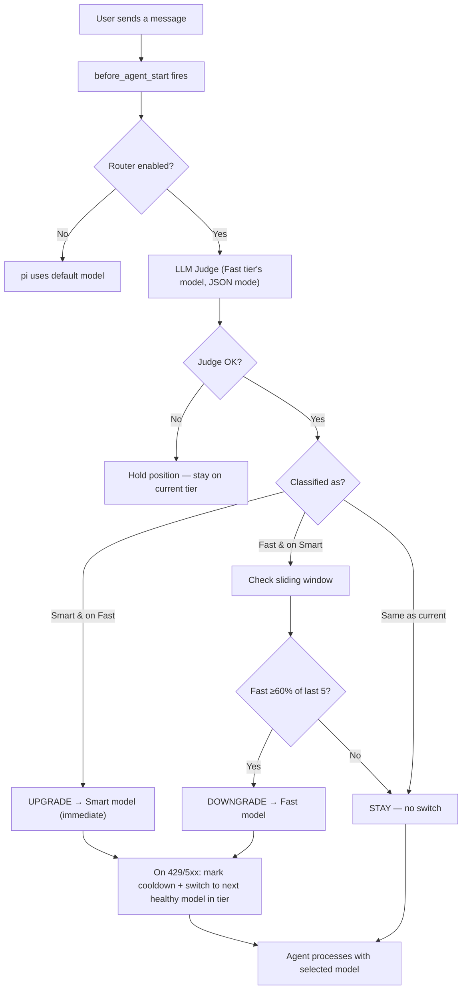

<!--
SEO metadata (not user-visible, parsed by crawlers / LLMs):
- name: pi-shift-router
- type: software / npm package / pi-coding-agent extension
- license: MIT
- language: TypeScript
- runtime: Node.js >= 24
- dependencies: zero runtime deps
- npm: https://www.npmjs.com/package/pi-shift-router
- repo: https://github.com/green-dalii/pi-shift-router
- docs: README.md / README.zh-CN.md / SPEC.md / CONTRIBUTING.md
- first-published: v0.4.0
- latest: v0.6.0
- features: two-tier routing, LLM judge, JSON-mode classifier, sliding-window
  downgrade gate, multi-model fallback chains, TUI chain editor,
  exponential-backoff runtime failover (429/5xx), shared cooldown map
  between routing and Judge, zero-config defaults, cross-provider native
- complementary: pi-model-router (3-tier + budget + rules), pi-smart-router (ML inference, local ONNX)
- author: green-dalii (https://github.com/green-dalii)
-->

# pi-shift-router

> Auto-routing Pi coding agent turns between fast execution and smart reasoning models — an LLM judge picks the right tier per turn, multi-model fallback chains keep you running, zero runtime dependencies.

[](https://www.npmjs.com/package/pi-shift-router)
[](https://www.npmjs.com/package/pi-shift-router)
[](LICENSE)
[](https://nodejs.org)
[](https://github.com/green-dalii/pi-shift-router/actions)
[](https://github.com/green-dalii/pi-shift-router)

[English] | [简体中文](README.zh-CN.md)

---

## TL;DR

- **What it is** — A [pi-coding-agent](https://github.com/earendil-works/pi-coding-agent) extension that routes every turn to either a fast execution model or a smart judgment model.
- **How it works** — Before each turn, a small LLM Judge (the fast-tier model itself) classifies the task as `fast` or `smart`.
- **Reliability** — Multi-model fallback chains per tier + exponential-backoff cooldown on 429/5xx — turns keep flowing when one provider rate-limits.
- **Zero dependencies** — Pure TypeScript. Single `npm install`, two-tier config, done.
- **Stable since** — v0.4.0 (npm, MIT, 202 unit tests, Node 24+).

### In pi, it looks like this

```text
🦾 [MiniMax-M3] → fix the failing test
⚖ judging…
🧠 [kimi-k3]              ← upgraded for the architecture question
⚠️ MiniMax-M3 429 → switching to deepseek-v4-flash — retry in 1m
🦾 [deepseek-v4-flash]     ← same-tier failover (v0.6.0)
```

Status bar badge changes tier automatically; toasts explain any switch.

---

## Contents

- [What it does](#what-it-does)
- [Quick Start](#quick-start)
- [How It Works](#how-it-works)
- [Commands](#commands)
- [Configuration](#configuration)
- [How It Compares](#how-it-compares)
- [FAQ](#faq)
- [Troubleshooting](#troubleshooting)
- [Roadmap](ROADMAP.md)
- [Contributing](CONTRIBUTING.md)

---

## What it does

**pi-shift-router** classifies every turn by **mental mode** and routes between two models:

| | Tier | Emoji | When |
|---|------|-------|------|
| Execution mode | **Fast** | 🦾 | Coding, debugging, tests, docs, following patterns |
| Judgment mode | **Smart** | 🧠 | Architecture, review, planning, security audit |

**Zero behavior change by default** — both tiers start empty. The router does nothing until you assign models via `/router config`.

> **Smart = CTO** (judgment, architecture, review, planning)
> **Fast = Programmer** (execution, coding, debugging, testing)

Not every task needs a CTO. But projects without CTO oversight don't sustain quality.

---

## Quick Start

**Prerequisites** — Node.js ≥ 24, pi-agent ≥ 0.80, one provider account with API key in pi-agent's `auth.json`, one model for each tier.

**Install**

```bash
pi install npm:pi-shift-router
```

Registers in `~/.pi/agent/settings.json` and auto-loads on next pi launch. See [pi's packages docs](https://github.com/earendil-works/pi-coding-agent/blob/main/docs/packages.md) for git / local-path install.

**Configure**

Inside pi, run `/router config` and pick one Fast + one Smart model. Save to user or project scope.

**Verify**

`/router status` shows your tiers and models; the next turn triggers the first Judge call.

---

## How It Works



Three properties that matter:

- **Upgrades are immediate** (Fast → Smart). Quality first.
- **Downgrades need sustained trend** (≥60% of last 5 turns are Fast). Cache protection.
- **One classification per turn.** No thrashing during tool calls.

**JSON-mode enforcement** (not just prompt instructions): OpenAI-compatible APIs use `response_format: { type: "json_object" }` (the API rejects non-JSON completions); Anthropic uses assistant prefill `{` to force JSON-start output. While the Judge is in flight, the status bar shows `⚖ judging…`.

### Runtime failover (v0.6.0)

When the primary model hits 429 / 5xx / quota / Token-Plan exhaustion, pi retries first (provider ×3, agent ×3), then the router takes over:

1. Mark the failing model into **exponential-backoff cooldown** (1m, 2m, 4m, … capped at 30m).
2. Immediately `setModel` to the next healthy model **in the same tier** (no cross-tier).
3. pi's pending retry continues with the fallback — same-turn failover.
4. Subsequent turns skip cooled models in `before_agent_start`.
5. A 2xx response clears the cooldown; session restart resets everything.

The Judge also walks the full fast-tier chain before giving up, sharing the same cooldown map as routing. Manual override (`/route-force`) always bypasses cooldowns. Auth/config errors (400/401) never trigger failover.

---

## Commands

| Command | What it does |
|---------|--------------|
| `/router status` | Show tier, model, window, config summary |
| `/router on` / `/router off` | Enable / disable routing |
| `/router config` | Launch the TUI configuration wizard |
| `/router quiet` | Toggle inline toast notifications |
| `/router verbose` | Toggle verbose console logging |
| `/route-force <tier>` | Pin Smart or Fast for the next turn |
| `/route-force <provider>/<model>` | Pin a specific model for the next turn |
| `/route-force auto` | Clear manual override |

---

## Configuration

Two-layer config: user (`~/.pi/agent/pi-shift-router.json`) + project (`<cwd>/.pi/pi-shift-router.json`). Project wins on conflict.

```json
{
  "enabled": true,
  "tiers": {
    "fast":  { "models": [
      { "provider": "deepseek", "model": "deepseek-v4-flash", "priority": 1 },
      { "provider": "kimi",     "model": "kimi-k3",          "priority": 2 }
    ] },
    "smart": { "models": [{ "provider": "kimi", "model": "kimi-k3", "priority": 1 }] }
  },
  "routing": { "mode": "auto", "judgeTimeout": 5000, "window": { "size": 5, "threshold": 0.6 } },
  "ux": { "quietMode": false, "statusBar": true, "inlineToast": true, "routerLogVerbose": false }
}
```

| Field | Default | Meaning |
|-------|---------|---------|
| `enabled` | `true` | Master switch. Use `/router off` to disable. |
| `tiers.<tier>.models[]` | `[]` | Ordered by `priority`. First hit wins; rest are run-time fallbacks. |
| `routing.judgeTimeout` | `5000` | ms. Judge API call timeout. |
| `routing.window.size` / `threshold` | `5` / `0.6` | Sliding-window downgrade gate. |
| `ux.quietMode` / `statusBar` / `inlineToast` / `routerLogVerbose` | various | Surface controls. |

Each tier's `models` array is an **ordered priority list** — first entry is the primary; later entries stand by as fallback. Configure multiple models via `/router config`'s TUI chain editor (`a` add, `x` remove, `J`/`K` reorder, `d` save, `Esc` cancel).

---

## How It Compares

| | pi-shift-router (this plugin) | pi-model-router | pi-smart-router |
|---|---|---|---|
| **Tiers** | 2 (fast/smart) | 3 (high/medium/low) | n-stage ML pipeline |
| **Classifier** | LLM Judge (JSON mode) | Optional LLM classifier → heuristic fallback | ONNX + Aho-Corasick |
| **Custom rules** | — | Keyword overrides | — |
| **Budget cap** | — | USD session budget; auto-downgrades high→medium | — |
| **Phase memory** | Sliding window for downgrade gate | `phaseBias` stickiness across turns | — |
| **Persistence** | Session-scoped | Cross-session, cross-branch (`router-state`) | Per-session |
| **Runtime failover** | 429/5xx + exponential-backoff cooldown | Profile-level fallback chain | — |
| **Deps** | Zero runtime (TS only) | npm package on pi SDK | ONNX, SQLite, HF |

**Pick by need:**

- **pi-shift-router** — LLM-as-classifier with zero runtime deps and runtime failover (429/5xx cooldown).
- **pi-model-router** — 3-tier routing, USD budget cap, keyword rules, persistent state across branches.
- **pi-smart-router** — ML-optimized local inference (ONNX).

These are complementary, not competitive — they sit at different layers of the stack.

---

## FAQ

### What if I don't configure any models?

Both tiers start empty. The router is a no-op; pi uses its default model. Run `/router config`.

### Does the Judge add noticeable latency?

A Judge call costs a few thousand tokens at your Fast-tier pricing. End-to-end classification round-trip is typically 200ms–2s. The status bar shows `⚖ judging…` during the call.

### What if my primary model 429s or times out?

Exponential-backoff cooldown (v0.6.0): primary goes into cooldown (1m → 2m → 4m … capped 30m) and the next healthy model in the same tier takes over. A 2xx response clears the cooldown immediately.

### Does this work across different providers?

Yes. Each tier stores an ordered list of `{provider, model, priority}` pairs. Mix freely.

### Will it downgrade Smart prematurely?

Only when the **weighted** ratio of fast votes in the last 5 classified turns is ≥ `window.threshold` (default `0.6`). Low-confidence votes below `window.minConfidence` (default `0.5`) are ignored. Raise `threshold` to `0.8` to stay on Smart longer. Upgrades (Fast → Smart) are always immediate.

### What's the difference from `pi-model-router` and `pi-smart-router`?

They solve different problems and can be used together — see the [comparison table](#how-it-compares).

### Can I disable the router temporarily without uninstalling?

`/router off` disables for the current session; `/router on` re-enables. Toggle persists in the config file.

### Is there cost overhead from the Judge?

The Judge uses the Fast-tier model (typically your cheapest). Savings from avoiding unnecessary Smart-tier turns dwarf this cost.

---

## Troubleshooting

### Judge unparseable warning

- **Reasoning model ran out of tokens** — DeepSeek Reasoner emits `reasoning_content` then JSON in `content`. Router sets `max_tokens: 4000`; very long prompts may overflow. Run `/router verbose` to inspect.
- **Provider doesn't support JSON mode** — some custom OpenAI-compatible endpoints ignore `response_format`.
- **API key invalid** — check pi-agent's `auth.json`.

### "No models match" in wizard

Models come from pi-agent's `models-store.json`. Restart pi-agent after adding a new provider.

### Status bar shows `⛔`

Router disabled — run `/router on`. If `enabled: true` in config but still shows `⛔`, check the `Config:` line in `/router status`.

### "Model not found" warning

Model ID doesn't exist in the provider. Update the ID or re-pick via `/router config` (only shows real models).

### Router keeps downgrading to Fast

Judge misclassifying (use `/router verbose`), or `window.threshold` too aggressive. Raise to `0.8`:

```json
"routing": { "window": { "size": 5, "threshold": 0.8, "minConfidence": 0.5 } }
```

---

## Acknowledgements

- **[pi-coding-agent](https://github.com/earendil-works/pi-coding-agent)** by earendil-works — the host agent.
- **[pi-tui](https://www.npmjs.com/package/@earendil-works/pi-tui)** — TUI primitives used by the model picker.
- **[pi-smart-router](https://github.com/beettlle/pi-smart-router)** — complementary ML-optimized inference routing (local ONNX).
- **[pi-model-router](https://github.com/yeliu84/pi-model-router)** — complementary 3-tier routing with USD budget + keyword rules.

---

**Author & License** — pi-shift-router by [green-dalii](https://github.com/green-dalii), licensed under [MIT](LICENSE) © 2026.