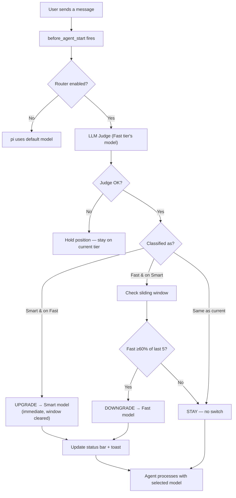
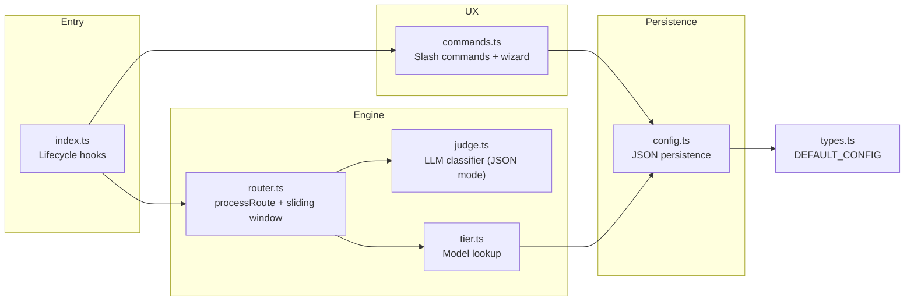

# pi-shift-router

> Auto-routing Pi coding agent turns between fast execution and smart reasoning models — an LLM judge picks the right tier per turn, multi-model fallback chains keep you running, zero runtime dependencies.

[](https://www.npmjs.com/package/pi-shift-router)
[](LICENSE)
[](https://www.typescriptlang.org/)
[](https://nodejs.org)
[](https://github.com/earendil-works/pi-coding-agent)
[](https://github.com/green-dalii/pi-shift-router/actions)

[English] | [简体中文](README.zh-CN.md)

---

## Contents

- [What it does](#what-it-does)
- [The Problem](#the-problem)
- [The Solution](#the-solution)
- [Quick Start](#quick-start)
- [How It Works](#how-it-works)
- [The Judge](#the-judge)
- [How It Compares](#how-it-compares)
- [Commands](#commands)
- [Configuration](#configuration)
- [Architecture](#architecture)
- [Development](#development)
- [Roadmap](#roadmap)
- [Troubleshooting](#troubleshooting)
- [Contributing](#contributing)
- [Acknowledgements](#acknowledgements)

---

## What it does

**pi-shift-router** is a [Pi coding agent](https://github.com/earendil-works/pi-coding-agent) extension that classifies every turn by **mental mode** and routes between two models:

| | Tier | Emoji | When |
|---|------|-------|------|
| Execution mode | **Fast** | 🦾 | Coding, debugging, tests, docs, following patterns |
| Judgment mode | **Smart** | 🧠 | Architecture, review, planning, security audit |

**Zero behavior change by default** — both tiers start empty. The router does nothing until you assign models via `/router config`.

---

## The Problem

Pi-agent supports multiple providers, but every conversation is locked to a single model.

- If you're using a cheap model for daily work, complex architecture tasks suffer.
- If you're using a top-tier model for everything, you're burning money on trivial turns.
- And manually switching `/model` every few minutes is not a workflow — it's a tax.

## The Solution

pi-shift-router hooks into pi-agent's turn cycle. Before every turn it asks an LLM Judge to classify the task, then switches the active model accordingly.

- **Two tiers** — Smart (🧠 CTO) and Fast (🦾 Programmer). Each tier can hold an ordered chain of models — the router uses the first entry, and later entries stand by as fallback if the primary is unavailable.
- **LLM Judge** — Uses the Fast model to classify "execution" vs "judgment". Cost per call is a few thousand tokens at your Fast-tier pricing — a small fraction of a cent.
- **Sliding window** — Prevents model thrashing: only downgrades when ≥60% of last 5 turns agree.
- **Zero-config until you want it** — Both tiers start empty. Nothing happens until you configure.
- **Interactive setup** — `/router config` opens a TUI wizard matching pi's native `/model`: fuzzy search, 10-item sliding viewport, arrow keys, Enter to select, Esc to cancel. Configure multiple models per tier as a hotkey-driven fallback chain (`a` add, `x` remove, `K`/`J` reorder).
- **Cross-provider native** — Fast can be DeepSeek Flash, Smart can be Kimi K3. Mix and match.

### The Analogy

> **Smart = CTO** (judgment, architecture, review, planning)
> **Fast = Programmer** (execution, coding, debugging, testing)

Not every task needs a CTO. But projects without CTO oversight don't sustain quality.

---

## Quick Start

### Prerequisites

- **Node.js ≥ 24** (GitHub Actions runners default to Node 24 as of 2025)
- **pi-agent ≥ 0.80** (see [pi-coding-agent](https://github.com/earendil-works/pi-coding-agent))
- **At least one provider account** with an API key configured in pi-agent's `auth.json`
- **Two models configured** (one for each tier) — you can use the same provider for both, or mix

### Install

```bash
pi install npm:pi-shift-router
```

This registers the package in pi-agent's `settings.json` and downloads it into `~/.pi/agent/`. On the next pi-agent launch, the extension auto-loads. See [pi's packages docs](https://github.com/earendil-works/pi-coding-agent/blob/main/docs/packages.md) for the full install surface (npm, git, local path).

### Configure

```bash
# Inside pi-agent:
/router config
```

The wizard walks you through provider → model selection for both tiers. Pick a fast everyday model (e.g., DeepSeek Flash) and a strong judgment model (e.g., Kimi K3). Save to user or project scope.

### Verify

```bash
/router status
```

You should see your tiers and models listed. The next turn will trigger the first Judge call.

### What you'll see

The status bar in the bottom of pi-agent shows the current tier:

```
> ask the model to design the auth architecture...
[🧠 kimi-k3]    ← upgraded automatically
```

Toggle verbose logging to see the routing decisions:

```
/router verbose
```

Output for every turn:

```
[ShiftRouter] ─── Turn start ───
[ShiftRouter] prompt: "design the auth architecture for..."
[ShiftRouter] current: [🦾 deepseek-v4-flash]
[ShiftRouter] Judge → deepseek-v4-flash (openai-completions)
[ShiftRouter] Judge raw: content='{"tier":"smart"}', reasoning="...", finish=stop
[ShiftRouter] Judge → smart
[ShiftRouter] judge: smart (llm), window=[] (0/0 fast)
[ShiftRouter] decision: upgrade → kimi/kimi-k3
[ShiftRouter] model switch ok
```

---

## How It Works



**Three properties that matter:**

- **Upgrades are immediate** (fast → smart). Quality first.
- **Downgrades require sustained trend** (≥60% of last 5). Cache protection.
- **One classification per turn.** No thrashing during tool calls.

---

## The Judge

pi-shift-router uses an LLM as the classifier. On every turn, before the agent starts, the router asks the **Fast tier's model** a single question:

> "Is this turn execution (`fast`) or judgment (`smart`)?"

Cost per call: a few thousand tokens at your Fast-tier model's pricing. The router easily pays for itself by avoiding even a single Smart-tier turn.

The Judge uses **API-level JSON mode**, not just prompt instructions:

- **OpenAI-compatible** (DeepSeek, OpenAI): `response_format: { type: "json_object" }` — the API rejects non-JSON completions.
- **Anthropic**: assistant message prefill of `{` — forces JSON-start output.
- **Parse fallback**: JSON parse → loose JSON → bare keyword.

While the Judge is in flight, the status bar briefly shows **`⚖ judging…`** so the user sees feedback during the 200ms–2s latency instead of a silent pause.

### Debugging

Toggle verbose logging to see every routing decision in the console:

```
/router verbose
```

Output shows the prompt preview, judge call details (URL, raw response), decision, and model switch result.

---

## How It Compares

| | pi-shift-router | pi-router | pi-smart-router |
|---|---|---|---|
| **What it does** | Routes by task complexity — execution vs judgment | Fails over between providers | ML-optimized inference pipeline |
| **Judge** | LLM-as-judge (uses Fast tier's model, a few thousand tokens per call) | Manual strategy config | ONNX + Aho-Corasick classifier |
| **Dimension** | Mental mode (execute vs decide) | Provider reliability | Execution engine |
| **Config** | 2 models (Smart + Fast) | Channel strategies | 12-stage pipeline |
| **Deps** | Zero runtime (TS only) | Zero runtime | ONNX, SQLite, HF |
| **Local inference** | No | No | Yes (LM Studio, Ollama) |
| **Learning curve** | Low — pick 2 models, done | Low-Medium | High |

**In short:** These are complementary, not competitive. pi-shift-router picks the right model **when both are working**; pi-router handles **provider failover**; pi-smart-router optimizes the **inference engine**. Different layers of the stack.

---

## Commands

| Command | What it does |
|---------|--------------|
| `/router status` | Show tier, model, window, and config summary |
| `/router on` | Enable routing |
| `/router off` | Disable routing — pi falls back to its default model |
| `/router config` | Launch the TUI configuration wizard |
| `/router quiet` | Toggle inline toast notifications |
| `/router verbose` | Toggle verbose console logging (debugging) |
| `/route-force <tier>` | Pin Smart or Fast for the next turn |
| `/route-force <provider>/<model>` | Pin a specific model for the next turn |
| `/route-force auto` | Clear manual override |

---

## Configuration

Two-layer config: user (`~/.pi/agent/pi-shift-router.json`) + project (`<cwd>/.pi/pi-shift-router.json`). Project wins on conflict.

```json
{
  "enabled": true,
  "tiers": {
    "fast":  { "models": [
      { "provider": "deepseek", "model": "deepseek-v4-flash", "priority": 1 },
      { "provider": "kimi",     "model": "kimi-flash",       "priority": 2 }
    ] },
    "smart": { "models": [{ "provider": "kimi", "model": "kimi-k3", "priority": 1 }] }
  },
  "routing": {
    "mode": "auto",
    "judgeTimeout": 5000,
    "window": { "size": 5, "threshold": 0.6 }
  },
  "ux": {
    "quietMode": false,
    "statusBar": true,
    "inlineToast": true,
    "routerLogVerbose": false
  }
}
```

**Field reference:**

| Field | Default | Meaning |
|-------|---------|---------|
| `enabled` | `true` | Master switch. Use `/router off` to disable. |
| `tiers.fast.models[]` | `[]` | Ordered by `priority`. First hit wins. |
| `tiers.smart.models[]` | `[]` | Same. |
| `routing.judgeTimeout` | `5000` | ms. Judge API call timeout. |
| `routing.window.size` | `5` | Sliding window length. |
| `routing.window.threshold` | `0.6` | Fraction of `fast` entries needed to downgrade. |
| `ux.quietMode` | `false` | Suppress inline toast on tier change. |
| `ux.statusBar` | `true` | Show `[🧠 model]` in footer. |
| `ux.inlineToast` | `true` | Notify on tier change. |
| `ux.routerLogVerbose` | `false` | Print routing decisions to console. |

### Fallback chains

Each tier's `models` array is an **ordered priority list** — first entry is the primary, later entries are fallbacks. At session start the router picks the first entry whose provider has a valid API key; the rest are reserved for future runtime failover.

You can configure multiple models per tier through `/router config`. The wizard opens an in-TUI editor:

```
Edit Fast models
  #1  deepseek/deepseek-v4-flash
  #2  kimi/kimi-flash
  #3  openai/gpt-4o-mini

↑↓ select · a add · x remove · K/J move · d done · Esc cancel
```

- `a` opens a type-to-filter picker (same UX as pi's native `/model`)
- `x` removes the current row
- `K` / `J` swap the current row with the one above / below (vim-style)
- `d` saves and exits, `Esc` cancels

Non-TUI mode falls back to the previous provider-grouped single-model picker.

---

## Architecture



### Module Map

| File | Responsibility |
|------|---------------|
| `index.ts` | Lifecycle hooks: `session_start` (read-only), `before_agent_start` (classify + route) |
| `router.ts` | `processRoute()`, `applyModelSwitch()`, sliding window |
| `judge.ts` | LLM Judge with JSON-mode enforcement + 3-layer parse fallback |
| `tier.ts` | Model lookup, `findBestModelForTier()`, display formatting |
| `config.ts` | JSON persistence, `resolveFastEndpoint()`, validation |
| `commands.ts` | `/router`, `/route-force`, config wizard |
| `tui/model-picker.ts` | TUI picker mirroring pi's native `/model` UX |
| `tui/fallback-chain-editor.ts` | Chain editor: add / remove / reorder tier models with hotkeys |
| `types.ts` | All interfaces + `DEFAULT_CONFIG` |

### Dependency Chain

```
index.ts → router.ts → judge.ts | tier.ts → config.ts → types.ts
commands.ts → config.ts, tier.ts, router.ts, types.ts
```

One-way, no cycles. See [`SPEC.md`](SPEC.md) for the full design.

---

## Development

```bash
git clone https://github.com/green-dalii/pi-shift-router.git
cd pi-shift-router
npm install
npm run build
npm test
```

### Scripts

| Script | What it does |
|--------|--------------|
| `npm run build` | TypeScript compile + copy `prompts/` to `dist/` |
| `npm run typecheck` | `tsc --noEmit` strict mode |
| `npm test` | Run vitest once |
| `npm run test:watch` | vitest watch mode |
| `npm run clean` | Remove `node_modules/` and `dist/` |

### Local install (for testing in pi)

After v0.4.0 the canonical install is the npm package. For local dev iteration against your checkout, use pi's path install:

```bash
# Remove any globally-installed version first (avoid duplicate plugins)
pi remove pi-shift-router

# Install from local path — pi runs npm install against this folder
pi install /Users/greener/project/slimrouter
```

After changing `src/`, rebuild and restart pi-agent:

```bash
npm run build
# restart pi-agent
```

### Releasing a new version

```bash
# 1. Bump version
npm version patch  # or minor / major

# 2. Validate before publish (test + build + pack:check)
npm run prepublishOnly

# 3. Publish (bypass 2FA token configured in ~/.npmrc)
npm publish --registry=https://registry.npmjs.org/

# 4. Update your local install
pi remove pi-shift-router
pi install npm:pi-shift-router

# 5. Tag the release
git tag -a v$(node -p "require('./package.json').version") -m "..."
git push origin --tags
```

### Principles

- **Simplicity over complexity.** Prefer expressions, delete before adding.
- **Two-tier > three-tier.** Execution vs judgment is the only axis that matters.
- **LLM judge, not regex.** No keyword lists. The LLM is the sole classifier.
- **Zero external runtime deps.** Only pi-agent SDK.
- **Tests cover the algorithm.** 80 tests on the routing engine + tier + config + judge parser + chain editor.

---

## Roadmap

| Phase | Status | Version |
|-------|--------|---------|
| Core engine + LLM Judge | ✅ | v0.1.0 |
| TUI model picker + wizard | ✅ | v0.2.0 |
| Two-tier redesign (CTO / Programmer) | ✅ | v0.3.0 |
| Judge JSON-mode + judging indicator + verbose log | ✅ | v0.3.1 |
| First npm publish (international docs + i18n + CI) | ✅ | v0.4.0 |
| Runtime `Cannot find package` fix + `pack:check` guard | ✅ | v0.4.1 |
| **Multi-model fallback chain editor** | ✅ | v0.5.0 |
| Runtime failover (cross-model on API errors) | Planned | v0.6 |
| Cache-aware routing | Planned | — |
| Multilingual Judge prompt validation | Planned | — |
| Per-session cost statistics | Planned | — |

---

## Troubleshooting

### "Judge unparseable" warnings

The Judge could not parse a valid JSON tier. Common causes:

- **Reasoning model ran out of tokens.** Some models (DeepSeek Reasoner, etc.) emit `reasoning_content` before the JSON answer. The router sets `max_tokens: 4000` which should be enough, but very long prompts may still overflow. Try `/router verbose` to see the raw response.
- **Provider doesn't support JSON mode.** Some custom OpenAI-compatible endpoints ignore `response_format`. Check the raw response with verbose logging.
- **API key invalid.** Check pi-agent's `auth.json` and confirm the key works for the chosen provider.

### "No models match your search" in wizard

The models listed in the wizard come from pi-agent's `models-store.json`. If a provider you just configured doesn't appear, restart pi-agent so it can re-discover the provider's models.

### Status bar shows `⛔` instead of a tier

The router is disabled. Run `/router on` to enable. If `enabled: true` is set in config but you still see `⛔`, check that the config file is being read (look at the `Config:` line in `/router status`).

### "Model not found" warning

The configured model ID doesn't exist in the model's provider. Either update the model ID in config or use `/router config` to re-pick from the wizard (which only shows models that actually exist).

### The router keeps downgrading to Fast when I want Smart

Either the Judge is misclassifying (use `/router verbose` to see), or the sliding window threshold is too aggressive. Adjust in config:

```json
"routing": { "window": { "size": 5, "threshold": 0.8 } }
```

Threshold `0.8` requires 4 out of 5 recent turns to be Fast before downgrade.

---

## Contributing

Bug reports, feature ideas, documentation improvements, and code changes are all welcome.

Read [CONTRIBUTING.md](CONTRIBUTING.md) first. The development principles are in [AGENTS.md](AGENTS.md) and the design contract in [SPEC.md](SPEC.md).

---

## Acknowledgements

- **[pi-coding-agent](https://github.com/earendil-works/pi-coding-agent)** by earendil-works — the host agent this extension plugs into.
- **[pi-tui](https://www.npmjs.com/package/@earendil-works/pi-tui)** — TUI primitives used by the model picker.
- **[pi-router](https://github.com/freescheme/pi-router)** — complementary provider failover routing.
- **[pi-smart-router](https://github.com/beettlle/pi-smart-router)** — complementary ML-optimized inference routing.
- The **DeepSeek**, **Anthropic**, **Kimi**, and other model teams whose APIs we call.

---

## Author

**pi-shift-router** is authored and maintained by [green-dalii](https://github.com/green-dalii).

Contributions are welcome — see [CONTRIBUTING.md](CONTRIBUTING.md).

---

## License

[Apache 2.0](LICENSE) © 2026 green-dalii and pi-shift-router contributors.