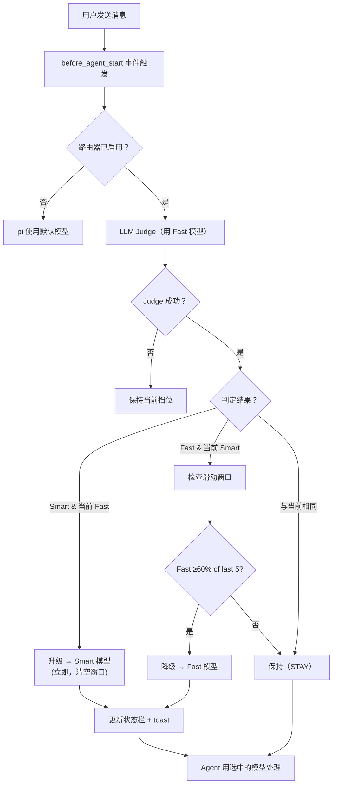
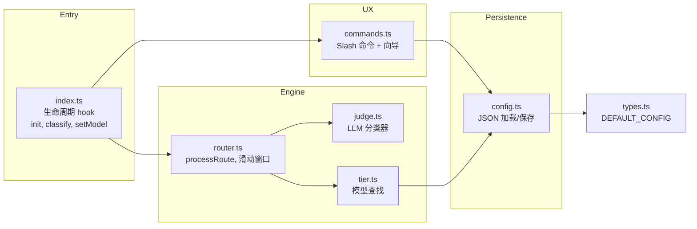

# pi-shift-router

> 为 Pi coding agent 自动路由每轮任务 —— 在 Fast 执行模型与 Smart 判断模型间动态切换，LLM Judge 自动分类，支持多模型 fallback 链，零运行时依赖。

[](https://www.npmjs.com/package/pi-shift-router)
[](LICENSE)
[](https://www.typescriptlang.org/)
[](https://github.com/earendil-works/pi-coding-agent)
[](https://github.com/green-dalii/pi-shift-router/actions)

[English](README.md) | [简体中文]

---

## 问题

Pi-agent 支持多个 Provider，但每个会话锁死在单一模型上。

- 日常用一个便宜模型：复杂架构任务质量跟不上
- 日常用一个顶级模型：琐碎任务在烧钱
- 每隔几分钟就要手动 `/model` 切换 —— 这不算自动化，是体力活

## 解决方案

**pi-shift-router** 接入 pi-agent 的会话周期，按 **心智模式**（执行 vs 判断）分类每轮任务，无缝切换当前激活的模型。

- **两层路由** — Smart（🧠 CTO）与 Fast（🦾 程序员）。每层可保存一个按优先级排序的模型链 —— 路由器用第一个，后续项作为 primary 不可用时的备用。
- **LLM Judge** — 用 Fast 模型的 API 调用来分类任务是"执行"还是"判断"。成本是几千 token 级别，相对于节省的开销可以忽略不计。
- **滑动窗口** — 防止模型频繁切换：仅当最近 5 轮中 ≥60% 都判定为 fast 时才降级。
- **零配置起步** — 两层默认都为空。直到你配置前，路由器什么都不做。
- **交互式向导** — `/router config` 启动 TUI 向导，复刻 pi 原生 `/model` 的体验：实时模糊搜索、10 项滑动视口、方向键导航、Enter 选中、Esc 取消。可用热键为每层配置多模型 fallback 链（`a` 添加、`x` 删除、`K`/`J` 重排）。
- **原生支持跨 Provider** — Fast 可以是 DeepSeek Flash，Smart 可以是 Kimi K3。任意组合。

### CTO / 程序员类比

> **Smart = CTO**：判断、架构、审查、规划 —— 工作量小但极其关键
> **Fast = 程序员**：执行、写代码、调试、测试 —— 工作量大但模式明确

不是所有任务都需要 CTO 级别的智力。但项目如果没有 CTO 把关，质量底线撑不住。

---

## 快速开始

```bash
# 安装（写入 pi-agent 的 settings.json）
pi install npm:pi-shift-router
```

该命令把包注册到 pi-agent 的 `~/.pi/agent/settings.json` 并下载到 `~/.pi/agent/`。下次启动 pi-agent 时会自动加载扩展。详见 [pi 包管理文档](https://github.com/earendil-works/pi-coding-agent/blob/main/docs/packages.md)。

```bash
# 启动配置向导（在 pi-agent 中）
/router config

# 为 Smart（🧠）和 Fast（🦾）各选一个模型
# 保存并退出 —— 搞定
```

路由器会在下一轮自动激活。运行 `/router status` 查看实时状态。

---

## 工作原理



### 关键属性

- **升级**（fast → smart）**立即**。质量优先。
- **降级**（smart → fast）需要**持续趋势**（最近 5 轮中 ≥60%）。保护缓存。
- **手动覆盖**（`/route-force smart`）锁定下一轮的模型，自动清除。
- **每轮 = 一次分类** —— 不在 tool call 粒度上切换。

---

## 对比一览

| | pi-shift-router | pi-router | pi-smart-router |
|---|---|---|---|
| **做什么** | 按心智模式路由 —— 执行任务用轻量模型，判断任务用顶级模型 | 在 Provider 之间故障转移 —— Provider A 挂了切 Provider B | ML 优化的推理管线 —— 12 阶段混合路由 |
| **何时用它** | "这个问题很简单，为什么要用旗舰 token？" | "Anthropic 不可用，切 Google 还能保留上下文" | "我要本地推理 + ONNX 智能路由" |
| **Judge 机制** | LLM-as-judge | 手动策略配置（延迟 / 能力 / 成本） | ONNX embedding + Aho-Corasick + 类型分类器 |
| **路由维度** | 心智模式**（执行 vs 判断） | Provider **可靠性**（这个还活着吗？） | 执行**引擎**（本地 vs 云，成本 vs 延迟） |
| **依赖** | 零运行时依赖（纯 TS） | 零运行时依赖（纯 TS） | ONNX、SQLite、HuggingFace Transformers |
| **本地推理** | 否 | 否 | 是（LM Studio、Ollama） |
| **学习曲线** | 低 —— 选两个模型搞定 | 中低 —— 配置通道和策略 | 高 —— 下载 ONNX 模型，本地编译 |

**一句话**：这三个是互补关系，不是竞争关系。甚至可以同时跑 —— pi-router 处理 Provider 故障转移，pi-smart-router 优化推理引擎，pi-shift-router 保证每个任务用对复杂度。

---

## The Judge

路由器每轮（Agent 开始工作之前）问 **Fast 模型** 一个问题：

> "这一轮是执行（`fast`）还是判断（`smart`）？"

每次调用就是几千 token —— 用的是 Fast 模型本身的定价，相对于节省的开销可以忽略不计。哪怕只是避免一次 Smart 轮的浪费，路由器就回本了。

Judge 使用 **API 层的 JSON mode**（不只是 prompt 指示）：

- **OpenAI 兼容**（DeepSeek、OpenAI）：`response_format: { type: "json_object" }` —— API 直接拒绝非 JSON 输出
- **Anthropic**：assistant message prefill `{` —— 强制以 JSON 开头
- **解析兜底**：JSON 解析 → 宽松 JSON → 裸关键字

Judge 调用期间，状态栏短暂显示 **`⚖ judging…`**，让用户在 200ms–2s 的延迟里有反馈，而不是沉默。

### 调试

开启 verbose 日志可以在控制台看到每一轮的决策细节：

```
/router verbose
```

输出包含：prompt 预览、judge 调用详情（URL、原始响应）、决策结果、模型切换结果。

---

## 命令

| 命令 | 功能 |
|------|------|
| `/router status` | 显示当前挡位、模型、窗口状态和配置摘要 |
| `/router on` | 启用路由 |
| `/router off` | 停用路由 —— pi 回退到默认模型 |
| `/router config` | 启动 TUI 配置向导 |
| `/router quiet` | 切换 toast 通知 |
| `/router verbose` | 切换 verbose 日志（调试） |
| `/route-force <tier>` | 临时锁定 Smart 或 Fast（一轮） |
| `/route-force <provider>/<model>` | 临时锁定指定 provider/model（一轮） |
| `/route-force auto` | 清除手动覆盖 |

---

## 配置

双层配置：用户级（`~/.pi/agent/`）+ 项目级（`.pi/`）。项目级优先。

```json
{
  "enabled": true,
  "tiers": {
    "fast":  { "models": [
      { "provider": "deepseek", "model": "deepseek-v4-flash", "priority": 1 },
      { "provider": "kimi",     "model": "kimi-flash",       "priority": 2 }
    ] },
    "smart": { "models": [{ "provider": "kimi", "model": "kimi-k3", "priority": 1 }] }
  },
  "routing": {
    "mode": "auto",
    "judgeTimeout": 5000,
    "window": { "size": 5, "threshold": 0.6 }
  },
  "ux": {
    "quietMode": false,
    "statusBar": true,
    "inlineToast": true
  }
}
```

### Fallback 链

每层的 `models` 数组是一个**按优先级排序的列表** —— 第一个是 primary，后续项是备用。会话启动时路由器选择第一个有合法 API key 的模型；其余项预留给未来的 runtime failover。

在 TUI 中通过 `/router config` 可配多模型。向导会打开一个内嵌编辑器：

```
Edit Fast models
  #1  deepseek/deepseek-v4-flash
  #2  kimi/kimi-flash
  #3  openai/gpt-4o-mini

↑↓ select · a add · x remove · K/J move · d done · Esc cancel
```

- `a` 打开 type-to-filter picker（与 pi 原生 `/model` 一致）
- `x` 删除当前行
- `K` / `J` 与上一行 / 下一行交换（vim 风格）
- `d` 保存退出，`Esc` 取消

非 TUI 模式仍然沿用之前按 Provider 分组的单模型选择器。

---

## 架构



### 依赖链

```
src/
├── index.ts        → router.ts, judge.ts, tier.ts, commands.ts
├── router.ts       → tier.ts, types.ts
├── judge.ts        → types.ts (+ prompts/judge.md)
├── tier.ts         → types.ts
├── commands.ts     → config.ts, tier.ts, router.ts, types.ts
├── config.ts       → types.ts
├── tui/
│   └── model-picker.ts  (TUI 组件，仅交互模式激活)
└── types.ts        (零依赖 —— 项目根基)
```

### 文件职责

| 文件 | 职责 |
|------|------|
| `index.ts` | 生命周期 hook：`session_start`、`before_agent_start` |
| `router.ts` | `processRoute()`、`applyModelSwitch()`、滑动窗口 |
| `judge.ts` | LLM Judge + 保持当前挡位兜底 |
| `tier.ts` | 模型查找、`findBestModelForTier()`、展示 |
| `config.ts` | JSON 持久化、`resolveFastEndpoint()` |
| `commands.ts` | `/router`、`/route-force`、配置向导 |
| `tui/model-picker.ts` | TUI picker，复刻 pi 原生 `/model` UX |
| `tui/fallback-chain-editor.ts` | Chain 编辑器：用热键添加 / 删除 / 重排层级模型 |
| `types.ts` | 所有 interface、`DEFAULT_CONFIG` |

---

## 开发

```bash
git clone https://github.com/green-dalii/pi-shift-router.git
cd pi-shift-router
npm install
npm run build
npm test
```

### 原则

- **简洁 > 复杂**。宁少一行不少一行。
- **两层 > 三层**。执行 vs 判断是唯一有意义的分类轴。
- **LLM Judge，不要正则**。不维护关键字列表。LLM 是唯一的分类器。
- **零外部运行时依赖**。只有 pi-agent SDK。
- **测试覆盖算法**。80 个测试守护路由引擎 + chain 编辑器。

[完整设计文档 →](SPEC.md)

---

## 作者

**pi-shift-router** 由 [green-dalii](https://github.com/green-dalii) 开发并维护。

欢迎贡献 —— 见 [CONTRIBUTING.md](CONTRIBUTING.md)。

---

## 许可

[MIT](LICENSE) © 2026 green-dalii 及 pi-shift-router 贡献者。