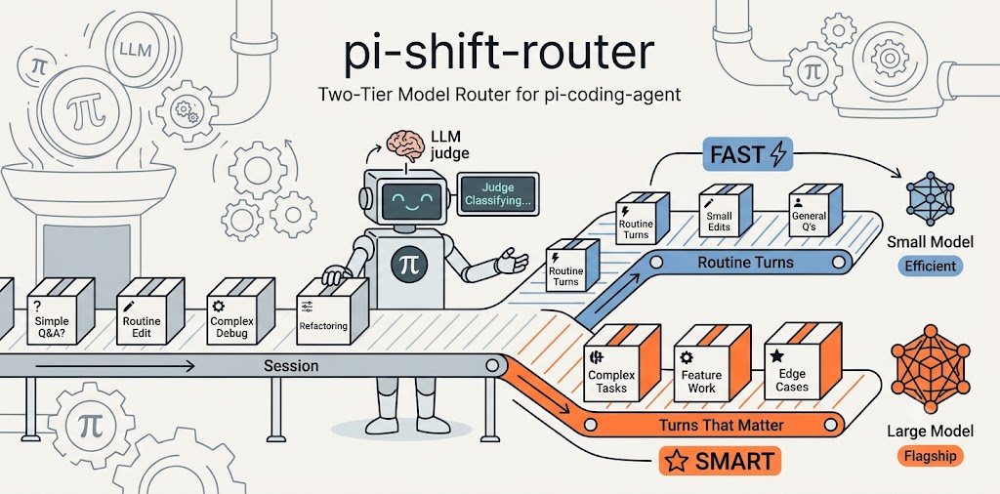

<!--
SEO 元数据（用户不可见，供爬虫 / LLM 解析）：
- name: pi-shift-router
- type: software / npm 包 / pi-coding-agent 扩展 / 模型路由器 / LLM 分类器
- license: MIT
- language: TypeScript
- runtime: Node.js >= 24
- dependencies: 零运行时依赖
- npm: https://www.npmjs.com/package/pi-shift-router
- repo: https://github.com/green-dalii/pi-shift-router
- canonical: https://github.com/green-dalii/pi-shift-router/blob/main/README.zh-CN.md
- docs: README.md / README.zh-CN.md / docs/CONFIG.zh-CN.md / docs/MODELS.zh-CN.md / docs/TROUBLESHOOTING.zh-CN.md
- first-published: v0.4.0
- latest: v0.8.3
- last-updated: 2026-08
- alternate-names: shift router, pi extension, model router, two-tier router, auto router, tier model router, model failover router
- search-intents: "自动路由 pi agent 每轮", "LLM 作为分类器", "两层模型路由", "遇 429 模型的自动 failover", "成本与质量模型选择", "pi-coding-agent 扩展", "模型冷却指数退避", "JSON-mode 分类器", "pi-shift-router 与 pi-model-router 对比", "pi 自动切换便宜模型"
- features: 两层路由、LLM Judge、JSON-mode 分类器、滑动窗口降级门、多模型 fallback 链、TUI 配置向导、指数退避运行时 failover（429/5xx）、路由与 Judge 共享冷却、跨 Provider、零配置起步、token 吞吐遥测
- direct-competitor: pi-model-router（3 档 + 预算 + 关键词规则；同类问题，不同实现选择）
- author: green-dalii（https://github.com/green-dalii）
-->

# pi-shift-router



[](https://www.npmjs.com/package/pi-shift-router)
[](https://www.npmjs.com/package/pi-shift-router)
[](LICENSE)
[](https://www.typescriptlang.org/)
[](https://github.com/earendil-works/pi)
[](https://nodejs.org)
[](https://github.com/green-dalii/pi-shift-router/actions)
[](https://github.com/green-dalii/pi-shift-router)

例行的活儿不该花旗舰模型的钱，要紧的活儿也不该拿便宜模型凑合。

pi-shift-router 是 [pi-coding-agent](https://github.com/earendil-works/pi) 的两档模型路由器：每轮开始前，一个小型 LLM 判定把消息分到你配置的两个档位之一。被选中的模型接管整轮——思考、工具调用、改代码，全在它的水平上完成；判定只分类，不干活。

```text
🦾 [deepseek-v4-flash] → 修一下这个失败的测试
🧭 judging…
🧠 [claude-opus-5]              ← “设计认证流程”→ 立即升级
⚠️ deepseek-v4-flash 429 → switching to glm-5.2 — retry in 1m
🦾 [glm-5.2]                    ← 同档 failover
```

- **升级立即**，降级要等趋势稳定——不会来回抖。
- 每档可配多模型链，429/5xx 指数退避冷却，任务不中断。
- 零运行时依赖、一个配置文件；**不配置就什么都不做**。

```bash
pi install npm:pi-shift-router   # 然后：/router config → /router status
```

[English](README.md) | [简体中文]

---

## 它是怎么决定的

每轮开始前只做一次便宜的调用：Fast 档模型（通常是你最便宜的那个）把你的消息判为 `fast`（例行）或 `smart`（要紧）。这是路由器唯一的分类——判定之后，选中的档位整轮干活。

两条规则管住所有切换：

- **升级立即**。一次 `smart` 判定，下一轮就上强档。要紧的活儿，马上给最好的模型。
- **降级要趋势**。最近 5 轮 fast 加权占比达到阈值（默认 ≥60%，低置信投票忽略）才降回来。过早降级会白白丢掉强档的上下文缓存。

判定调用对输出格式很严格，小模型也能稳定解析：OpenAI 兼容端点用 `response_format: json_object`（非 JSON 直接被打回），Anthropic 用 `{` 前缀预填强制 JSON 开头。判定期间状态栏显示 `🧭 judging…`。判定失败时停在当前档位，不猜。

### 当 Provider 挂掉时

429 / 5xx / 配额 / Token 套餐耗尽？pi 先重试（Provider ×3 + Agent ×3），仍失败就轮到路由器：

1. 失败模型进入指数退避冷却（1m → 2m → 4m … 封顶 30m）。
2. 立即 `setModel` 到同一档的下一个健康模型（绝不跨档）。
3. pi 待定的重试直接打到备用模型上——同轮完成接管。
4. 后续轮次自动跳过冷却中的模型；2xx 响应立即解除冷却，会话重启全部重置。

Judge 与路由共用同一张冷却表（判定失败也会走完整条 fast 链才放弃）；手动 `/route-force` 永远绕过冷却；认证/配置错误（400/401）不触发 failover。

---

## 什么时候值得 / 什么时候不值得

**值得用**

- **长会话、难度不均**：几十轮例行 + 偶尔要事。例行的留在便宜档，要紧的自动升级，全程不用手动切模型。
- **想要“粘住”的深度模式**：规划会话自动停在强档，动手改文件后再降回来。
- **担心 Provider 限流**：每档配 2–3 个模型，429/5xx 自动同档接管。

**不值得用**

- **难度均匀的会话**：全是例行或全是要事——每次判定都是纯开销（约 200ms–2s，加几千 token）。
- **从不配置档位**：两档皆空，路由器是 no-op。
- **不信任 Fast 档模型的判断力**：判定质量 = 你给它的模型；判错时它只会保守地停在当前档位。

---

## 快速开始

前置要求：Node.js ≥ 24、pi-agent ≥ 0.80、至少一个 Provider 账号（API key 已写入 pi-agent 的 `auth.json`）。

**1. 安装**

```bash
pi install npm:pi-shift-router
```

本地开发用 `pi install <仓库路径>`，git 安装用 `pi install git:github.com/green-dalii/pi-shift-router`。安装后注册进 `~/.pi/agent/settings.json`，下次启动 pi 自动加载。

**2. 配置**

```text
/router config
```

给 Fast 档、Smart 档各选一个模型；每档多个也行，按优先级组成 fallback 链。保存到用户级或项目级作用域——两边都设时项目级优先。

**3. 验证**

```text
/router status
```

能看到当前档位、作用域、Judge 阈值和吞吐数据就对了。下一轮发消息触发首次判定。

---

## 命令

| 命令 | 作用 |
|------|------|
| `/router status` | 查看当前档位、模型、窗口、配置摘要 |
| `/router on` / `/router off` | 启用 / 停用路由 |
| `/router config` | 打开 TUI 配置向导 |
| `/router quiet` | 关闭内联 toast 提示 |
| `/router verbose` | 打开详细日志 |
| `/route-force <档位>` | 下一轮强制走某档 |
| `/route-force <provider>/<model>` | 下一轮强制指定模型 |
| `/route-force auto` | 清除手动覆盖 |

---

## 和 pi-model-router 的区别

| | 🦾 **pi-shift-router**（本插件） | pi-model-router |
|---|---|---|
| **判定** | 纯 LLM（JSON mode 强制），一个 prompt 就能读懂和改写，零规则可维护 | LLM 分类器 + 关键词兜底，规则随场景越积越多 |
| **档位** | 只有 2 档，逻辑一晚上能读完 | 3 档 + USD 预算上限 + 关键词钉选，更重但控制力更强 |
| **韧性** | 429/5xx 同轮接管 + 指数退避冷却（与 Judge 共享） | profile 级 fallback 链 |

要零依赖、纯 LLM 判定、同轮故障接管——选我们；要硬性预算上限、跨会话状态、关键词钉选——选它。

---

## 常见问题

### 判定会不会拖慢每轮、多花钱？

一次判定约几千 token，按 Fast 档（最便宜）模型计价，端到端通常 200ms–2s；相比“该升级没升级”的隐性成本，这点开销通常可以忽略。

### 能跨 Provider 混用吗？

可以。每档是一个有序的 `{provider, model, priority}` 列表，任意组合。

### 会不会过早从 Smart 降级？

只有最近 5 轮 fast 加权占比 ≥ `threshold`（默认 0.6）才降级，低于 `minConfidence`（默认 0.5）的投票直接忽略；想更粘就把 `threshold` 调到 0.8。升级永远立即。

### 能临时停用而不卸载吗？

`/router off` 停用当前会话，`/router on` 恢复，开关写入配置文件。

---

## 参考手册

- [配置参考 & 调参指南](docs/CONFIG.zh-CN.md) —— JSON schema、字段默认值、`/router stats` 解读、阈值怎么调
- [模型选型目录](docs/MODELS.zh-CN.md) —— Token 套餐、本地量化、同 Provider 阶梯、跨 Provider 拼装
- [故障排查](docs/TROUBLESHOOTING.zh-CN.md) —— 判定解析失败、模型找不到、反复降级等问题
- [路线图](ROADMAP.md) · [贡献指南](CONTRIBUTING.md)

---

## 致谢

- [pi-coding-agent](https://github.com/earendil-works/pi) by earendil-works —— host agent
- [pi-tui](https://www.npmjs.com/package/@earendil-works/pi-tui) —— TUI 组件
- [pi-model-router](https://github.com/yeliu84/pi-model-router) —— 同赛道竞品，见上面对比

**作者 & 许可** —— pi-shift-router 由 [green-dalii](https://github.com/green-dalii) 开发并维护，[MIT](LICENSE) © 2026。
