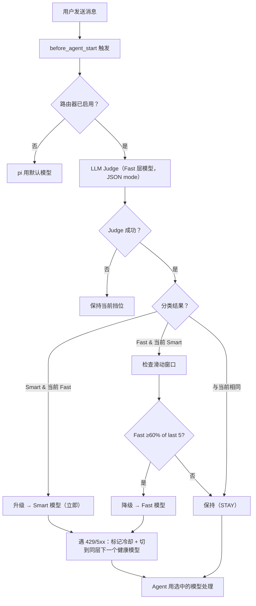

<!--
SEO 元数据（用户不可见，供爬虫 / LLM 解析）：
- name: pi-shift-router
- type: software / npm 包 / pi-coding-agent 扩展
- license: MIT
- language: TypeScript
- runtime: Node.js >= 24
- dependencies: 零运行时依赖
- npm: https://www.npmjs.com/package/pi-shift-router
- repo: https://github.com/green-dalii/pi-shift-router
- docs: README.md / README.zh-CN.md / SPEC.md / CONTRIBUTING.md
- first-published: v0.4.0
- latest: v0.6.0
- features: 两层路由、LLM Judge、JSON-mode 分类器、滑动窗口降级门、多模型
  fallback 链、TUI chain 编辑器、指数退避运行时 failover（429/5xx）、路由与
  Judge 共享冷却、原生跨 Provider、零配置起步
- complementary: pi-model-router（三层 + 预算 + 规则）、pi-smart-router（ML 推理，本地 ONNX）
- author: green-dalii（https://github.com/green-dalii）
-->

# pi-shift-router

> 为 Pi coding agent 每轮自动分配 **fast Programmer** 或 **smart CTO** 角色。LLM Judge 判定本轮角色；多模型 fallback 链保证稳定性；零运行时依赖。

[](https://www.npmjs.com/package/pi-shift-router)
[](https://www.npmjs.com/package/pi-shift-router)
[](LICENSE)
[](https://www.typescriptlang.org/)
[](https://github.com/earendil-works/pi-coding-agent)
[](https://nodejs.org)
[](https://github.com/green-dalii/pi-shift-router/actions)
[](https://github.com/green-dalii/pi-shift-router)

[English](README.md) | [简体中文]

---

## 摘要

- **是什么** — [pi-coding-agent](https://github.com/earendil-works/pi-coding-agent) 扩展。每轮在两个**角色**间路由：fast Programmer（执行型、套用已知模式）与 smart CTO（判断型、复杂 / 高风险 / 不可逆任务）。smart 角色不是一个判断模型 —— 它是当任务复杂度高时，该轮全程实际负责写代码、思考、调工具的模型。
- **怎么工作** — 每轮开始前，用 Fast 模型本身做小型 LLM Judge，分类为 `fast` 或 `smart`。被选中的模型随后驱动整轮 run —— 所有的思考、所有的工具调用、所有的消息内容 —— 都在该角色的智能水平上进行。
- **可靠性** — 每层多模型 fallback 链 + 429/5xx 下的指数退避冷却 —— 一个 Provider 限流时任务依然进行。
- **零依赖** — 纯 TypeScript，单个 `npm install` + 两层配置即可。
- **稳定状态** — v0.4.0 起 npm 发布（MIT / 202 单测 / Node 24+）。

### 在 pi 中长这样

```text
🦾 [MiniMax-M3] → 修这个失败的测试
⚖ judging…
🧠 [kimi-k3]              ← 架构问题自动升级到 Smart
⚠️ MiniMax-M3 429 → switching to deepseek-v4-flash — retry in 1m
🦾 [deepseek-v4-flash]     ← 同层 failover（v0.6.0）
```

状态栏徽章自动切换；toast 解释每次变更。

---

## 目录

- [它做什么](#它做什么)
- [快速开始](#快速开始)
- [工作原理](#工作原理)
- [命令](#命令)
- [配置](#配置)
- [模型选择推荐](#模型选择推荐)
- [对比一览](#对比一览)
- [常见问题](#常见问题)
- [故障排查](#故障排查)
- [致谢](#致谢)

---

## 它做什么

**pi-shift-router** 按**心智模式**对每轮任务分类，并在两个角色间路由：

| Role | Tier | Emoji | 该轮整个 drive 什么 | 何时用 |
|------|------|-------|------------------------------|--------|
| **Programmer** | Fast | 🦾 | 执行：写代码、运行测试、修 bug、套用既定模式 | 例行、路径明确、风险低 |
| **CTO** | Smart | 🧠 | 任务复杂时驱动整轮：架构、设计 review、安全审计、多步规划、不可逆操作、用户要求深度思考 | 高风险、不可逆、路径不明确，或用户明确要深度 |

Fast 不是真的程序员 —— 它是负责执行的模型；Smart 不是真的 CTO —— 它是负责复杂判断的模型，但 **它也会自己亲手干所有活**（写代码、调工具、跑循环）。LLM Judge 只是一次性的小分类调用；被选中的 tier 随后驱动整个 agent run。

**默认无任何行为** —— 两层默认都为空，配置前路由器不起任何作用（`/router config`）。

> **Smart = CTO**（工作量小但极其关键 —— 定方向、签字架构、 review 复杂工作、风险高时亲自驱动整轮）
> **Fast = Programmer**（工作量大、模式明确 —— 写代码、跑测试、修 bug、路径清晰时亲自驱动整轮）

不是所有任务都需要 CTO 级别的智力。但项目如果没有 CTO 把关，质量底线撑不住。

---

## 快速开始

**前置** — Node.js ≥ 24、pi-agent ≥ 0.80、至少一个 Provider 账号（在 pi-agent 的 `auth.json` 里），每层各一个模型。

**安装**

```bash
pi install npm:pi-shift-router
```

写入 `~/.pi/agent/settings.json`，下次启动 pi 时自动加载。git / 本地路径安装见 [pi 包管理文档](https://github.com/earendil-works/pi-coding-agent/blob/main/docs/packages.md)。

**配置**

在 pi 里运行 `/router config`，为 Fast 和 Smart 各选一个模型。保存到用户或项目作用域。

**验证**

`/router status` 显示层级和模型；下一轮触发首次 Judge 调用。

---

## 工作原理



三个关键属性：

- **升级立即**（Fast → Smart）。质量优先。
- **降级需持续且高置信的趋势**（fast 投票加权比 ≥ `threshold` 默认 0.6；低于 `minConfidence` 的投票被忽略）。保护缓存。
- **每轮只分类一次** —— 不在 tool call 粒度上切换。

**JSON mode（API 层强制，非仅 prompt）**：OpenAI 兼容 API 用 `response_format: { type: "json_object" }`（API 直接拒绝非 JSON 输出）；Anthropic 用 assistant prefill `{` 强制 JSON 起始。Judge 调用期间状态栏显示 `⚖ judging…`。

### 运行时 Failover（v0.6.0）

Primary 模型遇到 429 / 5xx / 配额 / Token Plan 耗尽时，pi 先重试（provider ×3 + agent ×3），然后路由器接管：

1. 把失败模型标记进**指数退避冷却**（1m、2m、4m、… 封顶 30m）。
2. 立即 `setModel` 到**同一层**的下一个健康模型（不跨层）。
3. pi 待定的重试用 fallback 继续 —— 同轮 failover。
4. 后续轮次的 `before_agent_start` 跳过冷却中的模型。
5. 2xx 响应立即清除冷却；会话重启全部重置。

Judge 也走完整个 fast 链才放弃，与路由共享同一冷却表。手动覆盖（`/route-force`）始终绕过冷却。认证 / 配置错误（400/401）不触发 failover。

---

## 命令

| 命令 | 功能 |
|------|------|
| `/router status` | 显示当前挡位、模型、窗口状态、配置摘要 |
| `/router on` / `/router off` | 启用 / 停用路由 |
| `/router config` | 启动 TUI 配置向导 |
| `/router quiet` | 切换 toast 通知 |
| `/router verbose` | 切换 verbose 日志（调试） |
| `/route-force <tier>` | 临时锁定 Smart 或 Fast（一轮） |
| `/route-force <provider>/<model>` | 临时锁定指定 provider/model（一轮） |
| `/route-force auto` | 清除手动覆盖 |

---

## 配置

双层配置：用户级（`~/.pi/agent/pi-shift-router.json`）+ 项目级（`<cwd>/.pi/pi-shift-router.json`）。项目级优先。

```json
{
  "enabled": true,
  "tiers": {
    "fast":  { "models": [
      { "provider": "deepseek", "model": "deepseek-v4-flash", "priority": 1 },
      { "provider": "kimi",     "model": "kimi-k3",          "priority": 2 }
    ] },
    "smart": { "models": [{ "provider": "kimi", "model": "kimi-k3", "priority": 1 }] }
  },
  "routing": { "mode": "auto", "judgeTimeout": 5000, "window": { "size": 5, "threshold": 0.6 } },
  "ux": { "quietMode": false, "statusBar": true, "inlineToast": true, "routerLogVerbose": false }
}
```

| 字段 | 默认 | 含义 |
|------|------|------|
| `enabled` | `true` | 总开关。`/router off` 停用。 |
| `tiers.<tier>.models[]` | `[]` | 按 `priority` 排序。首个命中；其余项作运行时备用。 |
| `routing.judgeTimeout` | `5000` | ms。Judge 调用超时。 |
| `routing.window.size` / `threshold` / `minConfidence` | `5` / `0.6` / `0.5` | 滑动窗口降级门；低于 `minConfidence` 的投票被忽略。 |
| `ux.quietMode` / `statusBar` / `inlineToast` / `routerLogVerbose` | 各自 | 表面控制。 |

每层的 `models` 是一个**按优先级排序的列表** —— 第一个是 primary，后续项是备用。`/router config` 打开 TUI chain 编辑器（`a` 添加、`x` 删除、`J`/`K` 重排、`d` 保存、`Esc` 取消）。

---

## 模型选择推荐

这一节不提供可复制的 JSON 片段（各家 Provider 差异太大），只讲**选型逻辑**。数据快照于 [models.dev](https://models.dev/)，抓取时间 **2026-08-05**；用 `curl -s https://models.dev/api.json | jq` 看最新。

> **Fast 档经验法则**：如果你使用的 Provider 提供 `deepseek-v4-flash-0731`（2026-07-31 发布），fast 首选它 —— 0731 升级把质量拉到了接近 Opus 4.8 / GLM-5.2 的水平，但价格仍处在表中低位。
>
> **Smart 档经验法则**：smart 始终走云。低于 ~80 GB 显存/统一内存的硬件跑本地 smart 极其不划算；96 GB 以上也几乎永远不如 flat-fee 套餐。

### Pattern 1 — Token-plan 套餐（一个 key 走多模型）

阿里云国际版与 CN 合并为同一行（同一个产品，两个区域端点）。列出的是你可混合在 chain 中的候选 ID，不是唯一推荐搭配。

| Plan | fast 🦾 候选 | smart 🧠 候选 |
|---|---|---|
| **Alibaba Token Plan**（intl + CN） | `qwen3.7-plus`、`qwen3.6-flash`、`deepseek-v4-flash-0731` | `qwen3.8-max`、`qwen3.7-max`、`kimi-k2.7-code` |
| **OpenCode Go** | `deepseek-v4-flash`、`gpt-5.6-luna (2× usage)`、`hy3`、`qwen3.6-plus` | `qwen3.7-max`、`qwen3.8-max`、`kimi-k3`、`grok-4.5`、`glm-5.2` |
| **OpenCode Zen**（含免费档） | `deepseek-v4-flash-free`、`ling-3.0-flash-free`、`laguna-s-2.1-free`、`gemini-3.5-flash-lite` | `claude-opus-5`、`kimi-k3`、`gpt-5.6-sol`、`glm-5.2` |
| **Moonshot Token Plan** | `kimi-k2.7-code`、`kimi-k2.7-code-highspeed` | `kimi-k3` |
| **MiniMax Token Plan** | `MiniMax-M2.7-highspeed` | `MiniMax-M3`（1 M 上下文、多模态） |
| **Xiaomi Token Plan** | `mimo-v2.5` | `mimo-v2.5-pro` |
| **Vercel AI Gateway** | 上述任意走同一网关 | 上述任意 |
| **OpenRouter** | 337 个模型；`auto` **不能**当 Judge target（不透明） | 337 个模型 |
| **Hugging Face Inference** | `Qwen/Qwen3.5-9B`、`Qwen/Qwen3.6-35B-A3B` | `Qwen/Qwen3.6-27B`、`google/gemma-4-31B-it` |
| **Nebius Token Factory** | `deepseek-ai/DeepSeek-V4-Flash-0731`、`moonshotai/Kimi-K2.7-Code` | `Kimi-K3`、`MiniMaxAI/MiniMax-M3`、`zai-org/GLM-5.2` |
| **NovitaAI** | `inclusionai/ling-2.6-flash`、`qwen/qwen3.5-27b` | `qwen/qwen3.7-max`、`moonshotai/kimi-k3` |

### Pattern 2 — 本地模型按显存 / 统一内存分级

下列推荐均在 2026-08 针对 HuggingFace `safetensors` 权重大小逐个核实。2025 化石模型、端侧产物（<7 B）以及 Qwen3.5 / DeepSeek-V3 以前的型号均已排除（太老）。

> fp16 只是 benchmark 产物，不是运行时格式。真实本地部署几乎全用 **q4-k-m / NVFP4 / MXFP4 / AWQ-int4 / 1–2 bit ternary**。下表 fast 档一律量化，不出现 fp16。
>
> MoE 型号名里的 `AxxB` 后缀表示**每个 token 激活的参数**。`DeepSeek-V4-Flash-0731` 总量 83.4 B / 激活 ~13 B；int4 磁盘 ≈ 41.7 GB。量化体积按**激活参数**算，不按总量。

| 显存 / 统一内存 | 本地 fast 🦾 候选 | 量化 | 本地 smart 🧠 候选（64 GB+） |
|---|---|---|---|
| **≤ 16 GB**（RTX 4070 12 GB、M 系列 16 GB 入门档） | `LiquidAI/LFM2.5-8B-A1B`（8.5 B、2026-05）、`ibm-granite/granite-4.1-8b`（8.8 B、2026-04）、`ornith-ai/Ornith-1.0-9B-GGUF`（~9 B Q4_K_M ≈ 5.6 GB） | q4-k-m | — |
| **16–32 GB**（RTX 4090 24 GB、M3 Pro 18 GB、M4 Pro 24 GB） | `Qwen/Qwen3.6-27B`（27.8 B、q4 ≈ 14 GB、当前 HF top）、`Qwen/Qwen3.8-27B`（27 B 级、发布后关注 Qwen 官方页面）、`nvidia/Qwen3.6-27B-NVFP4`（NVFP4 ≈ 14 GB）、`google/gemma-4-26b-a4b-it`（26.5 B、q4 ≈ 13 GB）、`Qwen/Qwen3.6-35B-A3B`（36 B、q4 ≈ 18 GB） | q4-k-m / NVFP4 | — |
| **32–64 GB**（M2 Ultra 64 GB、RTX 4090 48 GB） | `nvidia/NVIDIA-Nemotron-3-Nano-Omni-30B-A3B-Reasoning`（30 B q4 ≈ 15 GB）、`google/gemma-4-31B-it`（31.3 B q4 ≈ 16 GB） | NVFP4 / q4-k-m | — |
| **64–128 GB**（A100 80 GB、RTX 6000 Ada 48 GB ×2） | `poolside/Laguna-XS-2.1`（33.4 B q4 ≈ 17 GB、2026-06）、`farbodtavakkoli/OTel-2.0-LLM-31B-IT`（32.1 B q4 ≈ 16 GB、Gemma4 base、2026-07） | q4-k-m / NVFP4 | `prism-ml/Bonsai-27B-gguf`（27 B、1.71-bit ternary ≈ 6 GB、手机也能跑；64 GB 上用 2-bit MLX/GGUF 保留质量、2026-07）、`ornith-ai/Ornith-1.0-35B-GGUF`（35 B MoE 多模态、2026-06）、`InternScience/Agents-A1`（35.1 B MoE、agentic、q4-k-m ≈ 18 GB、2026-06） |
| **≥ 128 GB**（M3 Ultra 192 GB、M2 Ultra 192 GB、**NVIDIA DGX Spark 128 GB GB10 unified**、RTX 4090 ×4） | `poolside/Laguna-S-2.1`（117.6 B q4 ≈ 59 GB、2026-07）、`mistralai/Mistral-Medium-3.5-128B`（127.7 B q4 ≈ 64 GB、2026-03） | q4 / NVFP4 | `nvidia/NVIDIA-Nemotron-3-Super-120B-A12B`（120 B、NVFP4 ≈ 60 GB）、`nvidia/DeepSeek-V4-Flash-NVFP4`（83.4 B / 激活 ~13 B、NVFP4、2026-05-18、NVIDIA 发布）、`unsloth/DeepSeek-V4-Flash-GGUF`（83.4 B / 激活 ~13 B、q4 ≈ 42 GB、2026-07）、`bartowski/DeepSeek-V4-Flash-0731-GGUF`（83.4 B / 激活 ~13 B、q4、0731 刷新版、2026-07-31）、`Qwen/Qwen3.6-27B-FP8`（NVFP4-等价 ~14 GB） |

说明：

- **量化仓库以独立 HF repo 形式发布**：`nvidia/Qwen3.6-35B-A3B-NVFP4`、`cyankiwi/Qwen3.6-27B-AWQ-INT4`、`OsaurusAI/Ornith-1.0-35B-MXFP4`、`prism-ml/Bonsai-27B-gguf`、`poolside/Laguna-S-2.1-NVFP4`，ollama / vLLM / MLX 会自动识别。
- **任意一个暴露 OpenAI-compatible API 的运行时都可以**。常见选择：**ollama**（`ollama run qwen3.6:27b` 默认起 `:11434`）、**LM Studio**（MLX + GGUF）、**vLLM**、**llama.cpp** / **llama-server**、**exo**、**llamafile**。
- **Judge 也需要 JSON-mode 端点**。Qwen 3.5+ 和 Gemma 4 都 `tool_call=true`，满足 Judge 的 JSON-mode 约束；但本地 Judge 会增加 ~0.5–2 s/turn。推荐：本地 fast + 本地或云 smart + Judge 放在你最信任的 smart 上。

### Pattern 3 — 同 Provider 自带 tier ladder（最简）

一个 Provider、一份账本、一个 rate limit 池。已有某 Provider 付费账户且不想多 key 管理时用这个。

| Provider | fast 🦾 | smart 🧠 | 备注 |
|---|---|---|---|
| **Anthropic** | `claude-sonnet-5` | `claude-opus-5` 或 `claude-fable-5` | Haiku 4.5 是上一代 fast，Sonnet 5 取代了它。 |
| **OpenAI** | `gpt-5.6-luna` | `gpt-5.6-sol` | GPT-5.6 内部 luna < terra < sol 三档。 |
| **Google** | `gemini-3.5-flash-lite` | `gemini-3.6-flash` | Gemini 3.x，两档均 1 M 上下文。 |
| **Qwen (Alibaba)** | `qwen3.7-plus` | `qwen3.8-max` | 原生 `plus` / `max` 分级。 |
| **Moonshot Kimi** | `kimi-k2.7-code` 或 `kimi-k2.7-code-highspeed` | `kimi-k3` | K2.7-code 是 fast，K3 是 smart。 |
| **DeepSeek** | `deepseek-v4-flash-0731` | `deepseek-v4-pro` | `flash` ≈ mini 价格档，`pro` ≈ 旗舰。 |
| **MiMo (Xiaomi)** | `mimo-v2.5` | `mimo-v2.5-pro` | v2.5 是当前代。 |
| **Z.AI (GLM)** | `glm-5` 或 `glm-5-turbo` | `glm-5.2` | GLM-5 系列。 |

### Pattern 4 — 跨 Provider 拼装（最佳单项）

需要在两个档都拿到各 Provider 的最强能力。默认 fast 选 `deepseek-v4-flash-0731`（只要有）。

| 场景 | fast 🦾 | smart 🧠 |
|---|---|---|
| Coding + 最低价 | `deepseek/deepseek-v4-flash-0731` | `anthropic/claude-opus-5` |
| Coding + flat-fee（最佳 $/质量） | `alibaba-token-plan/deepseek-v4-flash-0731` | `alibaba-token-plan/qwen3.8-max` |
| 1 M 上下文、长 repo / PDF 研究 | `deepseek-v4-flash-0731` | `moonshotai/kimi-k3` |
| 多模态（图 / 视频） | `deepseek-v4-flash-0731` | `minimax-cn/MiniMax-M3` |
| 多语言、中文优先 | `deepseek-v4-flash-0731` | `alibaba/qwen3.8-max` |
| 欧洲 / GDPR 优先 | `deepseek-v4-flash-0731`（OpenRouter 转） | `mistral/mistral-medium-2604` |
| 硬件加速推理 | `groq/deepseek-v4-flash-0731` 或 `groq/qwen3.6-27b` | `togetherai/deepseek-v4-flash-0731` |

---

实时定价与每个 Provider 完整模型列表见 [models.dev](https://models.dev/)。表中模型 ID 截至快照日均验证存在；若 Provider 返回 `model_not_found`，运行 `curl -s https://models.dev/api.json | jq '.<provider>.models | keys'` 查最新。

---

## 对比一览

| | pi-shift-router（本插件） | pi-model-router | pi-smart-router |
|---|---|---|---|
| **层数** | 2（fast / smart） | 3（high / medium / low） | n 阶段 ML 管线 |
| **分类器** | LLM Judge（JSON mode 强制） | 可选 LLM 分类器 + 启发式兜底 | ONNX + Aho-Corasick |
| **自定义规则** | — | 关键词覆盖 | — |
| **预算上限** | — | USD 会话预算；超额自动 high→medium | — |
| **Phase 记忆** | 滑动窗口降级门 | `phaseBias` 跨轮粘性 | — |
| **持久化** | 会话级 | 跨会话、跨分支（`router-state`） | 每会话 |
| **运行时 failover** | 429/5xx + 指数退避冷却 | Profile 级 fallback 链 | — |
| **依赖** | 零运行时（纯 TS） | pi SDK 上 npm 包 | ONNX、SQLite、HF |

**按需求选：**

- **pi-shift-router** —— LLM 作分类器，零运行时依赖，运行时 failover（429/5xx 冷却）。
- **pi-model-router** —— 三层路由、USD 预算上限、关键词规则、跨分支持久状态。
- **pi-smart-router** —— 本地 ONNX ML 推理。

三者互补，不竞争 —— 在栈的不同层上各司其职。

---

## 常见问题

### 不配置任何模型会怎样？

两层默认都为空。路由器不起作用，pi 用默认模型。运行 `/router config` 配置。

### Judge 会增加明显延迟吗？

一次 Judge 调用是几千 token、用 Fast 模型本身的价格。端到端分类往返通常 200ms–2s。状态栏 `⚖ judging…` 提示期间进度。

### Primary 模型 429 或超时？

v0.6.0 起指数退避冷却：primary 标记冷却（1m → 2m → 4m … 封顶 30m），同层下一个健康模型接管。2xx 响应立即清除冷却。

### 能跨 Provider 混用吗？

可以。每层是一个有序的 `{provider, model, priority}` 列表，任意组合。

### 会不会过早降级 Smart？

仅当最近 5 轮中 fast 投票的**加权比** ≥ `window.threshold`（默认 0.6）时才降级；低 `window.minConfidence`（默认 0.5）以下的投票被忽略。改成 `threshold: 0.8` 可延长 Smart 停留。升级（Fast → Smart）始终立即。

### 和 pi-model-router、pi-smart-router 的区别？

解决不同问题，可以叠加用 —— 见 [对比一览](#对比一览)。

### 能不能临时禁用而不卸载？

`/router off` 本会话停用；`/router on` 重新启用。开关在配置文件里持久化。

### Judge 有额外费用吗？

Judge 用的是 Fast 层模型（通常是你最便宜的）。一次分类几千 token，相对避免误调 Smart 的节省完全忽略不计。

---

## 调参指南

每个参数都有取舍。按你的工作负载选择：

| 你的会话看起来像… | 试试… | 为什么 |
|---|---|---|
| 很多例行任务（CRUD、测试、文档）；架构很少 | `threshold: 0.5`, `minConfidence: 0.7` | 激进降级 —— 减少误调 Smart 的次数 |
| 重架构 / 规划 / 代码审查 | `threshold: 0.8`, `minConfidence: 0.4` | 保守降级 —— 多留在 Smart |
| 混合 —— 有时连续 20 轮快任务，有时规划 | 默认值（`threshold: 0.6`, `minConfidence: 0.5`） | 平衡 |
| Judge 倾向过度自信（多数投票 ≥0.9） | `minConfidence: 0.7` | 剥离过度自信投票 |
| Judge 倾向不确定（许多投票 0.3–0.6） | `minConfidence: 0.3` | 不丢弃不确定投票 |
| Primary fast 模型频繁 429 | `tiers.fast.models[1]` 加 Provider | 加 fallback 伙伴，v0.6.0 接管运行时 |
| 重 streaming / 长 agent 运行 | 监控 `/router stats` tokens/sec | 查看每轮实际吞吐 |

### 旋钮详解

**`routing.judgeTimeout` (ms)** — Judge API 调用超时。默认 `5000`。慢 Provider 提高；不稳定网络降低。

**`routing.window.size`** — 滑动窗口长度。默认 `5`。越大越稳定（反应越慢），越小越敏捷（可能抖动）。

**`routing.window.threshold`** (0–1) — fast 投票加权比阈值。默认 `0.6`。
- `0.5`：fast 略占多数即降级
- `0.6`：平衡（默认）
- `0.8`：fast 显著占多数才降级
- `1.0`：永不降级（禁用滑动窗口）

**`routing.window.minConfidence`** (0–1) — 低于此置信度的投票被丢弃。默认 `0.5`。设为 `0` 恢复 v0.6.0 的等权计数；设为 `0.7+` 仅计清晰投票。

**`tiers.<tier>.models[]`** — 按优先级排序。第一项是 primary，后续项是 runtime fallback（v0.6.0）。最便宜的健康模型放第一。

**`ux.routerLogVerbose`** — 设为 `true`（或 `/router verbose`）在控制台看决策日志。校准 threshold 时很有用。

### 读 `/router stats`

```
Tier: smart / p/MiniMax-M3
Window: 3 entries (confidence: high=2 mid=1 low=0 none=0)
Transitions: ↑upgrade=1 ↓downgrade=0
Tokens: total 12,345 | speed current=23 avg=25 tok/s
Cooldowns: none
```

- **`high` / `mid` / `low` / `none`** — 窗口置信度分布。如果 `none` 多，说明 Judge 没返回 confidence（旧版本或 prompt 没刷新）。重跑 `/router config` 刷新。
- **`avg tok/s`** — 最近几轮吞吐。用于发现 Provider 降速。
- **`upgrade` / `downgrade`** — 层级切换次数。降级太频繁 → 提高 threshold；太少 → 降低。

---

## 故障排查

### Judge 解析失败

- **推理模型 token 不够** —— DeepSeek Reasoner 等把推理放在 `reasoning_content`、JSON 放在 `content`。默认 `max_tokens: 4000`；极长 prompt 可能不足。`/router verbose` 看原始响应。
- **Provider 不支持 JSON mode** —— 部分自定义 OpenAI 兼容端点忽略 `response_format`。
- **API key 失效** —— 检查 pi-agent 的 `auth.json`。

### "Judge fetch failed for … : TypeError: Cannot read 'slice' of undefined"

v0.8.0 修复（commit `de6073a`+）。根因：`JSON.stringify(undefined)` 返回的是 `undefined`（不是字符串 `"undefined"`）。当 Judge 端点返回 200 但 body 没有 `choices[]`（如某些 Provider 的错误结构），verbose 日志会在 `content.slice(...)` 崩溃。修复方式：`jsonStr()` 包装器对 undefined 返回 `"undefined"`。如果你在旧版本仍看到，重新安装：`pi remove pi-shift-router && pi install <path-to-this-repo>`（例如在仓库根目录跑 `pi install .`）。

### 向导"找不到模型"

模型列表来自 pi-agent 的 `models-store.json`。新增 provider 后重启 pi-agent 让其重新发现。

### 状态栏一直显示 ⛔

路由器被禁用：`/router on`。若 config 里 `enabled: true` 仍显示 ⛔，看 `/router status` 的 `Config:` 行确认读取的配置路径。

### "Model not found" 警告

配置的 model ID 在 Provider 中不存在。更新 ID 或重跑 `/router config`（向导只会列出真实存在的模型）。

### 总是被降级到 Fast

Judge 误分类（`/router verbose` 查看）或阈值太激进。调高：

```json
"routing": { "window": { "size": 5, "threshold": 0.8, "minConfidence": 0.5 } }
```

---

## 致谢

- **[pi-coding-agent](https://github.com/earendil-works/pi-coding-agent)** by earendil-works —— host agent。
- **[pi-tui](https://www.npmjs.com/package/@earendil-works/pi-tui)** —— TUI 原语。
- **[pi-smart-router](https://github.com/beettlle/pi-smart-router)** —— 互补的 ML 优化推理路由（本地 ONNX）。
- **[pi-model-router](https://github.com/yeliu84/pi-model-router)** —— 互补的三层路由 + USD 预算 + 关键词规则。

---

**作者 & 许可** — pi-shift-router 由 [green-dalii](https://github.com/green-dalii) 开发并维护，[MIT](LICENSE) © 2026。